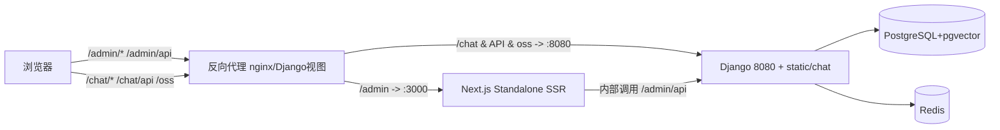

## 用户需求

基于现有 MaxKB 源码，将前端从 Vue 改为 React，本次**仅迁移 admin 管理后台**，chat 对话端保留 Vue。技术选型为 **Next.js + React + Ant Design**。交付物为一份**架构设计方案文档**（本次不直接修改代码）。

## 产品概述

admin 是 MaxKB 的企业级管理控制台，包含登录、首页工作台、系统设置、模型提供方、知识库、文档/段落、智能体应用、工具库、触发器等业务模块，以及基于 LogicFlow 的高级工作流编排编辑器。本方案设计其从 Vue3(Element Plus/Pinia/vue-router/vue-i18n) 到 Next.js(App Router)+React+Ant Design 的完整迁移架构与部署拓扑。

## 核心特性

- 用 Next.js App Router 承接现有 14 个路由模块与权限路由守卫，保留动态路由与鉴权流程。
- 用 Zustand 替换 11 个 Pinia store；用 Ant Design 替换 Element Plus 组件与主题。
- 用 next-intl 承接 84 个 vue-i18n 语言包，保持文案 key 不变、兼容外置语言包。
- 复用现有 axios 请求层（拦截器/流式 fetch/WebSocket/导出）并改为 Next 的 rewrites 代理到 Django 8080。
- 将 @logicflow 工作流编辑器（168 文件）以 React 封装组件形式重建，保持编辑能力一致。
- 设计 Next standalone SSR 服务与现有 Django 静态托管共存的部署拓扑，chat 端不受影响。

## 技术栈选型

- 框架：Next.js（App Router，standalone 输出，开启 `basePath: '/admin'`），React 18+，TypeScript。
- UI 组件库：Ant Design v5（`@ant-design/nextjs-registry` 解决 SSR 样式注水）。
- 状态管理：Zustand（轻量、贴合 React hooks，替代 Pinia）。
- 国际化：next-intl（替代 vue-i18n，保留现有 key）。
- 请求：axios（保留现有封装）+ fetch（流式/SSE）+ 原生 WebSocket。
- 工作流：`@logicflow/core` + `@logicflow/extension`（框架无关，React 侧以 `useRef`+`useEffect` 封装）。
- 构建/代理：`next.config.mjs` 的 rewrites 替代 vite 代理；样式用 Sass Modules + AntD token。
- 第三方库替代：md-editor-v3→`@mdxeditor/react`（或 `md-editor-rt`）、vue-codemirror→`@uiw/react-codemirror`、vue-draggable-plus/sortablejs→`@dnd-kit`、echarts→`echarts-for-react`、cropperjs→`react-cropper`、jsencrypt/mermaid/highlight.js/katex 通用直用、vueuse→`ahooks`。

## 实现方案

**总体策略**：在 `ui/admin`（或独立 `admin/` 目录）建立 Next.js 工程承载 admin，chat 继续留在 `ui/`（Vue 构建）。Next 以 standalone 单实例提供 SSR，由反向代理（nginx 或 Django 视图）按路径分流：`/admin`→Next(:3000)、`/chat` 与 `/admin/api`、`/chat/api`、`/oss`→Django(:8080)。这样既能发挥 Next 的 SSR/路由能力，又复用现有 Django 认证与 API，chat 端零改动。

**关键决策与权衡**：

1. **部署拓扑选 standalone 而非 `output:'export'`**：用户明确要 SSR，纯静态导出会丧失该收益；代价是需新增 Node 进程与代理，但 chat 仍由 Django 托管，二者登录态通过同一域 cookie 共享。
2. **`window.MaxKB.prefix`/`chatPrefix` 运行时替换逻辑**：现有 `admin.html` 内联 `prefix:'/admin'`、`chatPrefix:'/chat'`，并在 `web.py` 运行时按 `CONFIG.get_admin_path()` 改写 `index.html`。Next 改用 `basePath:'/admin'`（构建期固定）与 `NEXT_PUBLIC_CHAT_PREFIX` 注入，Django `page_not_found` 中针对 admin 的 `prefix` 字符串替换逻辑改为不再需要（或仅保留 chat 段），避免运行时改写 HTML。
3. **SSR 与鉴权**：用 `middleware.ts` 实现原 `router.beforeEach` 的鉴权与跳转（无 token 跳 `/login`、401 跳登录）；服务端组件通过 Route Handler/Server Action 经内部地址调用 Django API（携带 cookie 中的 token），客户端组件保留 axios 直连 `/admin/api`。
4. **LogicFlow 客户端隔离**：编辑器依赖 DOM/画布，必须用 `dynamic(() => import(...), { ssr: false })` 客户端加载，避免 SSR 报错。
5. **API 层复用**：现有 `request/index.ts` 的拦截器（token、Accept-Language、错误态、流式、blob 导出、WebSocket）逻辑平移到 React 封装；`baseURL` 由 `prefix+'/api'` 改为 `/admin/api`（rewrites 指向 8080），与 `next.config` rewrites 对齐。

**性能与可靠性**：SSR 首屏提升感知；AntD 经 `@ant-design/nextjs-registry` 避免样式闪烁；LogicFlow 仅在工作流页按需加载（懒加载 + `ssr:false`）控制包体与内存；保留 NProgress 等价loading。复用现有 API 契约，不改动后端。

## 实现要点（防回归）

- 仅改动 admin 相关构建产物；`main.py` 的 `collect_static` 改为仅收集 chat 产物（或新增 `collect_admin` 阶段交由 Next 独立部署），勿破坏 chat 流程。
- 语言包 key 严格保持不变，外置语言包 `/chat/locales` 发现机制在 admin 中按 `/chat/locales` 前缀保留。
- 权限判定 `hasPermission`（基于 `user.getPermissions()` 与 `meta.permission`）平移为 `usePermission` hook + `middleware` 双层校验，保持 OR/AND 语义。
- 主题：原 `use-element-plus-theme` 运行时改主题色，改为 AntD `ConfigProvider` `theme.token.colorPrimary` 动态注入，避免引入 Vue 专属依赖。
- 日志仅保留必要接口错误提示，沿用 `MsgError` 等价封装，避免敏感信息外泄。

## 架构设计

### 部署拓扑



### 目录映射

- `ui/src/views/*` → `admin/app/(admin)/<module>/page.tsx`（按 router/modules 拆：application/knowledge/document/paragraph/model/system/tool/trigger）
- `ui/src/components/*` → `admin/components/*`（AntD 封装后的通用组件）
- `ui/src/layout/*` → `admin/app/(admin)/layout.tsx` + `admin/components/layout/*`（侧边栏/顶栏/登录布局）
- `ui/src/workflow/*` → `admin/components/workflow/*`（LogicFlow React 封装 + 节点 renderer）
- `ui/src/stores/modules/*` → `admin/store/*.ts`（Zustand slice）
- `ui/src/api/*` → `admin/lib/api/*`（axios 实例复用）
- `ui/src/request/*` → `admin/lib/request.ts`
- `ui/src/locales/lang/*` → `admin/messages/<locale>.ts`（next-intl）
- `ui/src/styles/*` → `admin/styles/*`（Sass Modules + AntD token）
- `ui/src/permission/*` → `admin/lib/permission.ts` + `middleware.ts`
- `ui/src/utils/*`、`directives/*`、`bus/*` → `admin/lib/*`、AntD `App` 上下文、`eventemitter`

### 关键流程

1. 启动：`main.ts`（注册 Pinia/ElementPlus/i18n/指令）→ `app/layout.tsx`（AntD Registry + ConfigProvider + NextIntlClientProvider + Zustand Provider）。
2. 鉴权：`router.beforeEach` → `middleware.ts`（读取 cookie token，未登录重定向 `/login`）。
3. 接口：`request/index.ts` → `lib/request.ts`（rewrites 到 Django）。
4. 工作流：`workflow/index.vue(new LogicFlow)` → `components/workflow/Editor.tsx`（client-only，动态注册 React 节点）。

## 目录结构（本次为方案文档，标注目标结构）

```
admin/                                  # [NEW] Next.js admin 工程（替代 ui/ 中 admin 部分）
├── app/
│   ├── layout.tsx                      # [NEW] 根布局：AntD Registry + Intl + Zustand Provider
│   └── (admin)/
│       ├── layout.tsx                  # [NEW] 后台框架布局（侧边栏/顶栏，对等 layout/*）
│       ├── login/page.tsx              # [NEW] 登录页
│       ├── home/page.tsx               # [NEW] 工作台
│       ├── application/...             # [NEW] 应用/工作流入口（含 workflow 动态路由）
│       ├── knowledge/...               # [NEW] 知识库/文档/段落
│       ├── model/...                   # [NEW] 模型提供方
│       ├── system/...                  # [NEW] 系统设置
│       ├── tool/...                    # [NEW] 工具库
│       └── trigger/...                 # [NEW] 触发器
├── components/                         # [NEW] 通用组件（Table/Form/Modal/Message 封装，对等 components/*）
│   └── workflow/                       # [NEW] LogicFlow React 封装与节点 renderer
├── lib/
│   ├── request.ts                      # [NEW] axios 实例 + 拦截器（平移 request/index.ts）
│   ├── api/                            # [NEW] 业务接口（平移 api/*，83 文件）
│   ├── permission.ts                   # [NEW] usePermission + hasPermission（平移 permission/utils）
│   └── store/                          # [NEW] Zustand slices（平移 stores/modules/*）
├── messages/                           # [NEW] next-intl 语言包（平移 locales/lang/*）
├── middleware.ts                       # [NEW] 路由鉴权守卫（平移 router.beforeEach）
├── next.config.mjs                     # [NEW] basePath '/admin' + rewrites 到 Django 8080
└── styles/                             # [NEW] 全局样式 + AntD token（平移 styles/*）
ui/                                     # [MODIFY] 仅保留 chat（Vue）；vite.config 收敛为 chat 单入口
main.py                                  # [MODIFY] collect_static 仅收集 chat 产物（admin 交 Next 独立部署）
apps/maxkb/urls/web.py                  # [MODIFY] 移除 admin 静态托管/prefix 改写，仅保留 chat 段
```

## 关键代码结构（核心契约）

```typescript
// next.config.mjs 关键契约
const nextConfig = {
  basePath: '/admin',
  output: 'standalone',
  async rewrites() {
    const target = process.env.API_TARGET ?? 'http://127.0.0.1:8080'
    return [
      { source: '/admin/api/:path*', destination: `${target}/admin/api/:path*` },
      { source: '/chat/api/:path*', destination: `${target}/chat/api/:path*` },
      { source: '/oss/:path*', destination: `${target}/oss/:path*` },
    ]
  },
}
```

```typescript
// lib/request.ts 请求基址（平移现有 baseURL 逻辑）
const request = axios.create({
  baseURL: (process.env.NEXT_PUBLIC_BASE_PATH ?? '/admin') + '/api',
  timeout: 1800000,
})
// 拦截器注入 AUTHORIZATION(Bearer) 与 Accept-Language，错误态 401→login、403→提示
```

```typescript
// lib/store/theme.ts（平移 use-element-plus-theme）
// 改为 AntD ConfigProvider theme.token.colorPrimary 动态注入
```

## 迁移路线图（建议阶段）

- 阶段 0：脚手架（Next 工程、basePath/rewrites、Provider、next-intl、Zustand、axios 封装）。
- 阶段 1：核心设施（请求层、store 映射、i18n、permission hook、布局/框架、路由壳+鉴权 middleware）。
- 阶段 2：共享组件与主题（Table/Form/Modal/Message 封装、AntD 主题 token、样式迁移）。
- 阶段 3：业务模块（登录、首页、system、model、knowledge/document/paragraph、application、tool、trigger）。
- 阶段 4：工作流编辑器（LogicFlow React 封装 + 节点 renderer，按需懒加载 ssr:false）。
- 阶段 5：联调与验证（Django 代理、SSR 数据、权限、i18n、e2e），chat 端不受影响。

## 验证方式

- 本地 `next dev`（:3000）经代理访问 `127.0.0.1:8080` 的 `/admin/api`；`next build` + `next start` 验证 SSR 与 standalone。
- 回归：登录态、菜单权限、语言切换、主题色、工作流增删节点与连线、导出/流式接口、chat 端独立可用。
- 通过 `ruff`/构建不改动后端；`main.py collect_static` 仅收集 chat 产物。

## Agent Extensions

### Skill

- **doc-coauthoring**
- 用途：按结构化写作流程撰写本架构设计方案技术文档（提案/技术规格），组织章节、迭代与校验可读性。
- 预期结果：产出一份结构完整、术语一致、可直接评审的《MaxKB admin 前端 Vue→Next.js+React+AntD 架构设计方案》文档。