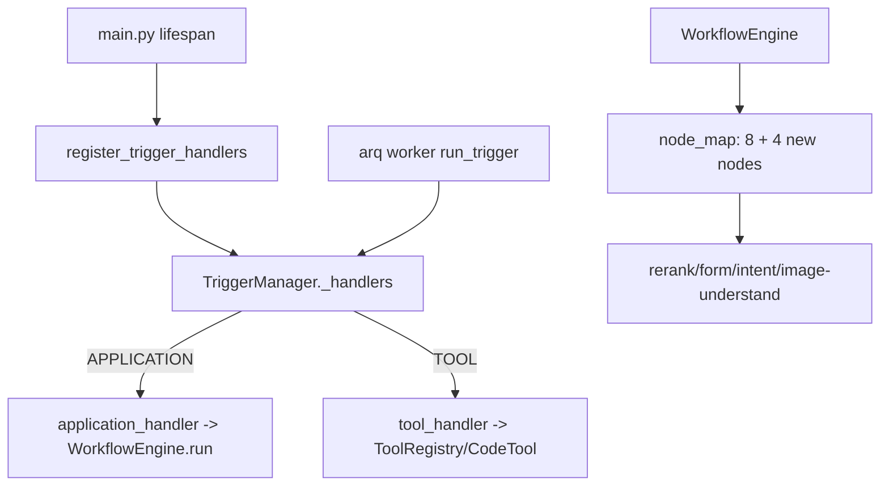

## 用户需求

继续完成 MaxKB 后端（FastAPI 重构底座）未重构完成的任务，并使用真实环境连接信息让后端端到端跑通：

- PostgreSQL：10.58.12.60:54321，密码 difyai123456
- Redis：10.58.12.61:6379，密码 12345

## 产品概述

把此前仅通过静态检查与单测（不依赖真实 PG/Redis）的 FastAPI 新底座，接入真实数据库与缓存，补齐触发执行链路与更多工作流节点，使其成为可实际运行的服务。

## 核心功能

- 端到端启动：用提供的 PG/Redis 配置 backend/.env，验证 asyncpg/redis 连通性，执行 alembic 迁移（stamp 到 head），启动 web(8080) 与 arq worker，并就地修复首次真实连接暴露的运行时错误。
- 触发执行接线：实现并注册 APPLICATION（工作流）与 TOOL（工具）两类 source_type 的真实 handler 到 TriggerManager，使定时/事件触发能真正执行而非返回 "no handler" 错误。
- 补齐工作流节点：参考 legacy `apps/application/flow/step_node` 迁移 rerank / form / intent / image-understand（图片理解）四类高价值节点，注册进 node_map，缩小 8/140 的差距。
- 配置安全：backend/.env 仅本地验证用，加入 .gitignore，不提交。

## 技术栈

- 沿用现有重构底座：FastAPI + SQLModel + Agno + arq + asyncpg + pgvector + redis.asyncio
- 配置：pydantic-settings 读取 `MAXKB_*` 环境变量（已支持 `.env`）
- 不引入任何新框架，严格复用 `app.core.db`、`app.workflows`、`app.tools`、`app.trigger` 现有模式

## 实现方案

### 1. 端到端跑通（配置 + 连通 + 启动）

- 新建 `backend/.env`，写入 `MAXKB_DB_HOST=10.58.12.60`、`MAXKB_DB_PORT=54321`、`MAXKB_DB_PASSWORD=difyai123456`、`MAXKB_REDIS_HOST=10.58.12.61`、`MAXKB_REDIS_PORT=6379`、`MAXKB_REDIS_PASSWORD=12345`。
- 在根 `.gitignore` 追加 `backend/.env`（仅本地，不提交）。
- 连通性验证脚本：`asyncpg.connect` 检查 PG（含 pgvector 扩展），`redis.asyncio` ping 检查 Redis。
- 迁移：表由 legacy Django 创建，`db.py` 严禁 `create_all`；执行 `uv run alembic upgrade head`（空基线 0001_empty，等价于 stamp，不建表）。若 alembic 未 stamp 过需先 `alembic stamp 0001_empty`。
- 启动：`uv run python main.py` 起 web；`uv run python -c "from app.core.tasks import run_worker; run_worker()"` 起 arq worker；用 `/providers` 或 health 路径确认 200。
- 首次真实连接可能暴露序列化/依赖问题，按错误就地修复（如 pgvector 类型映射、asyncpg 版本）。

### 2. 触发执行接线

- 已由代码核查确认：`event_trigger_task.source_type` 取值为 `APPLICATION` / `TOOL`（大写，见 `apps/trigger/models/trigger.py` 的 `TriggerTaskTypeChoices` 与 `backend/app/models/trigger.py`）。
- 新增 `backend/app/trigger/handlers.py`：
- `application_handler(payload)`：用 `payload["source_id"]` 从 application 表读取工作流 `work_flow` JSON 及 model/embedding 配置，构造 `WorkflowEngine(flow, params, model_config=, embedding_config=)` 并 `.run()`，写入 `event_trigger_task_record`。
- `tool_handler(payload)`：用 `payload["source_id"]` 经 `app.tools.registry.get_tool` 或 tool 表加载工具（内置/CodeTool），执行并返回结果。
- 导出 `register_trigger_handlers()`：调用 `manager.register_handler("APPLICATION", ...)` 与 `manager.register_handler("TOOL", ...)`；派发时按大写匹配，兼容大小写。
- 在 `backend/main.py` 的 lifespan 启动钩子中调用 `register_trigger_handlers()`（确保进程内注册；执行时才真正查库）。
- 验证：`run_trigger` 经 arq 调用 `manager.execute_trigger` 时，两个 source_type 均命中真实 handler。

### 3. 补齐工作流节点

- 每个节点继承 `app.workflows.nodes.base.StepNode`，实现 `execute()`，风格对齐现有 `tool.py`/`llm_chat.py`/`search_knowledge.py`。
- 迁移集合（务实 4 类，参考 `apps/application/flow/step_node/`）：
- `rerank`：对 `search_knowledge` 结果做重排（优先调用 reranker provider；未配置则按得分透传）。
- `form`：聚合上游参数输出结构化表单字段，作为 pass-through 节点。
- `intent`：用 `get_llm` 做意图分类，输出分支 `branch_id`。
- `image-understand`（图片理解）：多模态节点，用 `get_llm` 传入图片与文本。
- 通过 `register_node(cls)` 注册进 `node_map`，并补 `tests` 覆盖（复用现有无 DB 单测模式）。

## 实现要点（防回归）

- 严守 `db.py` 不 `create_all`；迁移只走 alembic stamp。
- handler 注册在启动钩子内、执行时再查库，避免导入期强依赖 application/tool 模型。
- source_type 派发归一化为大写，避免大小写不匹配导致 "no handler"。
- `.env` 含共享环境密码，仅本地、加入 .gitignore、不提交。
- 端到端验证在具备 PG(pgvector)/Redis 的环境进行；CI 仍只跑 lint + 无 DB 单测。

## 架构设计



## 目录结构与文件

```
backend/
├── .env                          # [NEW] 写入 PG/Redis 连接信息（不提交，加入 .gitignore）
├── app/
│   ├── main.py                   # [MODIFY] lifespan 启动钩子调用 register_trigger_handlers()
│   ├── trigger/
│   │   └── handlers.py           # [NEW] application_handler / tool_handler / register_trigger_handlers()
│   └── workflows/nodes/
│       ├── __init__.py           # [MODIFY] 通过 register_node 注册 4 个新节点
│       ├── rerank.py             # [NEW] RerankNode（对检索结果重排）
│       ├── form.py               # [NEW] FormNode（结构化表单聚合）
│       ├── intent.py             # [NEW] IntentNode（LLM 意图分类，输出 branch_id）
│       └── image_understand.py   # [NEW] ImageUnderstandNode（多模态图片理解）
└── tests/
    └── workflows/
        └── test_new_nodes.py     # [NEW] 新节点单测（无 DB，复用现有模式）
```