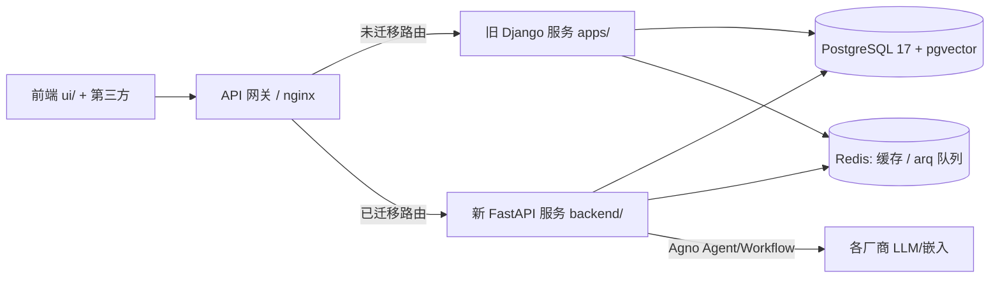
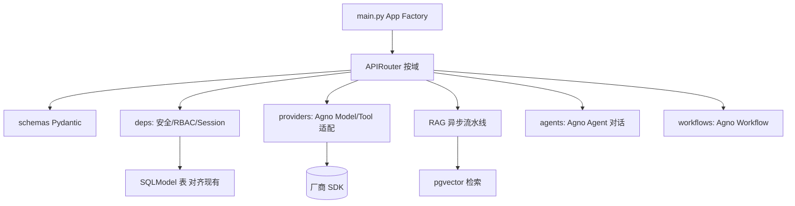

## 用户需求

将 MaxKB 后端从 Django 5.2 + DRF + LangChain 重构为 **FastAPI + SQLModel + Agno** 技术栈，给出可落地的重构方案。

## 已确认的重构边界（用户决策）

- **推进策略**：并行新服务。新建独立 FastAPI 后端，通过网关按路由逐步切流，旧 Django 服务逐步退役（新旧并存、可回滚）。不修改 `apps/` 现有代码。
- **数据处理**：必须保留现有 PostgreSQL 业务数据并平滑迁移，需 schema 映射 + 迁移脚本，禁止重建表导致丢数据。
- **自研核心模块去留**：
- `models_provider` 模型抽象层 → 改用 **Agno Model/Tool** 体系替代（逐一搬运 `impl/` 厂商实现，保留凭据校验/加密）。
- `flow` 工作流引擎（181 文件，146 个 step_node）→ 改用 **Agno Workflow** 重写（分最小子集到全量）。
- `knowledge` RAG/向量层（pgvector 解析与检索）→ **继续沿用**其解析与检索逻辑，改写为异步流水线。
- `Celery` 异步任务 → **不保留**，改用 FastAPI 原生能力（async + BackgroundTasks + 轻量队列）简化。
- **基础设施**：用 FastAPI 原生（async/BackgroundTasks + 轻量替代）替换 Celery；保留 PostgreSQL + pgvector + Redis 作为存储/缓存/向量底座。

## 核心目标

在不中断现有业务的前提下，构建与旧服务共享同一 PostgreSQL/Redis 的独立 FastAPI 服务，按模块灰度切流，最终退役 Django。

## 技术栈选型

- **Web 框架**：FastAPI（ASGI，原生 async）+ Uvicorn/Gunicorn(UVicornWorker)。
- **ORM**：SQLModel（`table=True`），异步引擎 **asyncpg**；迁移用 **Alembic**（仅增量、可加列，绝不 drop 现有表）。
- **智能体框架**：Agno（Agent / Workflow / Model / Tool / Knowledge）。
- **配置**：pydantic-settings，兼容现有 `MAXKB_*` 环境变量与 `SERVER_NAME`（`web`/`local_model`）。
- **缓存/向量/队列**：Redis（async，redis-py async 或 arq 轻量任务队列替代 Celery）；pgvector 经 asyncpg 直接访问或 Agno `PgVector`。
- **RAG 解析（沿用）**：pypdf / python-docx / openpyxl / beautifulsoup4 / markdownify / sentence-transformers / torch / jieba。
- **安全**：FastAPI `OAuth2PasswordBearer` + JWT（PyJWT/python-jose），RBAC 依赖注入。
- **i18n**：polib + gettext（沿用 `locales/`）。
- **工程**：uv 包管理、ruff(120)、pytest + httpx(AsyncClient) 测试，独立 `backend/pyproject.toml`。

## 实现策略（高层）

采用**共享数据库 + 绞杀者网关**模式：新建 `backend/`（与 `apps/`、`ui/` 并列）作为独立服务，直连**同一 PostgreSQL 与 Redis**。由于新旧服务操作同一批表，"数据平滑迁移"的本质是 **SQLModel 表/列必须与现有 `db_table` 及字段类型严格对齐**，而非双写两份存储。因此：

1. 通过 Alembic 对现有库生成"基线"（定义好 SQLModel 后 autogenerate 得到近乎空的初始迁移），后续仅做加法迁移；任何 `create_all()` 都必须禁用，避免误删/改列。
2. 网关按端点灰度：未迁移路由仍转发给 Django，已迁移路由转发给 FastAPI；单端点可秒级回滚。
3. `models_provider` → 抽象一层 **Agno Model/Tool 适配器**（端口 `impl/` 各厂商，保留 `BaseModelCredential.is_valid`/`encryption_dict` 语义）；`flow` → Agno Workflow（先实现 LLM/知识库/工具/条件等最小节点集，再补齐 146 个节点）；`knowledge` RAG 解析与 pgvector 检索逻辑原样搬运为 async 流水线。

## 关键技术决策与权衡

- **共享 DB 而非双写**：最大幅度降低数据风险与复杂度，回滚只需切网关。风险点是 SQLModel 与 Django 字段语义（null/default/类型）不一致会触发 Alembic 误改，故基线阶段必须逐一比对 `apps/*/models/*.py` 的 `db_table` 与字段。
- **Celey 替代**：BackgroundTasks 仅适合短任务；大批量嵌入/索引属长任务，采用 **arq（基于 Redis 的轻量异步任务队列）** 替代 Celery，避免引入重组件，同时保留定时能力（arq cron）。
- **Agno 语义对齐**：Agno 的 Model/Tool/Knowledge/Workflow 与原 `models_provider`/`chat_pipeline`/`flow` 并非一一对应，需建立适配层而非硬套；RAG 召回仍走自研 pgvector 检索以保证与现有 `embedding`/`paragraph` 表兼容，Agno Knowledge 仅作为可选封装。
- **性能**：全程 async（asyncpg、httpx、redis async）；pgvector 检索加 ivfflat/hnsw 索引；嵌入批量并发；连接池复用。

## 实现注意（防回归）

- **绝不修改 `apps/`**：所有新增代码在 `backend/`，旧服务保持可运行直至退役。
- **字段对齐优先**：SQLModel 列用 `sa_column` 显式指定类型/nullable/default，对齐 Django 定义；对 `user`/`application`/`knowledge`/`document`/`paragraph`/`problem`/`embedding`/`file`/`tool` 等核心表逐表核对。
- **日志与安全**：复用现有日志风格（模块名 `maxkb.*`）；密钥经现有 `encryption_dict` 等价逻辑处理，不落明文。
- **爆炸半径控制**：网关按路由 + 功能开关切流；每阶段可独立回滚；先在只读/低危端点（如模型列表、知识库查询）试点。

## 架构设计

目标运行时（同一 PG/Redis，网关分流）：



新服务内部分层：



## 目录结构（新建 `backend/`，不改动 `apps/`）

```
backend/
├── pyproject.toml              # [NEW] uv 依赖(fastapi/sqlmodel/agno/alembic/asyncpg/arq/pydantic-settings/redis/...)，独立环境
├── alembic.ini                 # [NEW] Alembic 配置，指向 backend/app/core/db.py 的 metadata
├── alembic/
│   ├── env.py                  # [NEW] 连接同一 PG，target_metadata=SQLModel.metadata
│   └── versions/              # [NEW] 基线迁移(近空) + 后续增量
└── app/
    ├── main.py                 # [NEW] FastAPI 工厂：lifespan(引擎/redis/arq)、挂载 router、CORS、静态(可选)
    ├── core/
    │   ├── config.py           # [NEW] pydantic-settings，兼容 MAXKB_*/SERVER_NAME，映射 DB/Redis/本地模型配置
    │   ├── db.py               # [NEW] asyncpg 引擎 + session 依赖；禁用 create_all
    │   ├── redis.py            # [NEW] async redis 客户端
    │   ├── security.py         # [NEW] JWT/OAuth2 + RBAC 依赖(映射到 user 表)
    │   ├── tasks.py            # [NEW] arq 封装(替代 Celery)：嵌入/索引/定时任务
    │   └── i18n.py             # [NEW] polib/gettext 兼容
    ├── models/                 # [NEW] SQLModel 表，table_name 严格对齐现有 db_table
    │   ├── base.py             # [NEW] 公共字段(id/created_at/updated_at)
    │   ├── user.py             # [NEW] 对齐 user / user_group / 权限表
    │   ├── knowledge.py        # [NEW] 对齐 knowledge/document/paragraph/problem/embedding/file/tag
    │   ├── application.py      # [NEW] 对齐 application/application_chat/...
    │   ├── tool.py             # [NEW] 对齐 tool/tool_workflow
    │   └── trigger.py          # [NEW] 对齐 event_trigger
    ├── schemas/                # [NEW] 请求/响应 Pydantic（替代 DRF serializer）
    ├── api/                    # [NEW] APIRouter 按域：users/knowledge/application/chat/tools/system/trigger
    ├── providers/              # [NEW] Agno Model/Tool 适配层（搬运 impl/）
    │   ├── base.py             # [NEW] IModelProvider 等价抽象 + 凭据校验/加密(对齐 BaseModelCredential)
    │   ├── openai.py
    │   ├── anthropic.py
    │   ├── ...                 # 各厂商逐一端口
    ├── rag/                    # [NEW] knowledge 异步流水线(解析/拆分/嵌入/检索)
    │   ├── parsers.py          # [NEW] 沿用 pypdf/docx/openpyxl/bs4 解析
    │   ├── splitter.py         # [NEW] 文本拆分(沿用策略)
    │   ├── embed.py            # [NEW] 调用 providers 嵌入
    │   ├── vector.py           # [NEW] pgvector 检索(asyncpg)
    │   └── pipeline.py         # [NEW] 编排(经 arq 异步执行)
    ├── agents/                 # [NEW] Agno Agent 重写 chat_pipeline + long_term_memory
    │   └── chat_agent.py
    ├── workflows/              # [NEW] Agno Workflow 重写 flow 引擎
    │   ├── engine.py           # [NEW] 工作流执行器(替代 workflow_manage.py)
    │   └── step_nodes/         # [NEW] 各节点(替代 step_node/146 文件，先最小子集)
    └── tests/                  # [NEW] pytest + httpx AsyncClient + alembic 测试库
```

## 关键代码结构（接口级，仅示意对齐约束）

SQLModel 必须显式对齐现有 `db_table` 与列，避免 Alembic 误迁移：

```python
from sqlmodel import SQLModel, Field
from sqlalchemy import Column, String, Text

class Knowledge(SQLModel, table=True):
    __tablename__ = "knowledge"          # 严格对齐 apps/knowledge/models/knowledge.py 的 db_table
    id: str = Field(primary_key=True)
    name: str = Field(sa_column=Column(String(128), nullable=False))
    # 其余字段逐一对照现有 Model 定义，确保类型/nullable/default 一致
```

Provider 适配层需保留原 `BaseModelCredential` 的校验与加密语义（接口级）：

```python
class IModelProvider:
    def get_model(self, model_type: str, model_name: str, credential: dict) -> "agno.models.base.Model":
        ...  # 返回 Agno Model 实例（如 OpenAIChat），沿用原 new_instance 逻辑
    def is_valid_credential(self, model_type, model_name, credential, raise_exception=False) -> bool:
        ...  # 对齐 BaseModelCredential.is_valid
```

## Agent Extensions

### SubAgent

- **code-explorer**
- Purpose: 在阶段 0/1 大规模映射现有代码——逐表核对 `apps/*/models/*.py` 的 `db_table` 与字段（生成 SQLModel 对齐清单），枚举 `models_provider/impl/` 各厂商实现与 `flow/step_node/` 全部节点类型，输出待端口清单。
- Expected outcome: 产出"现有表→SQLModel 映射表""厂商 impl→Agno Model 映射表""flow 节点→Agno Workflow 步骤映射表"，为后续逐模块实现提供精准清单，避免遗漏或字段错位导致数据风险。