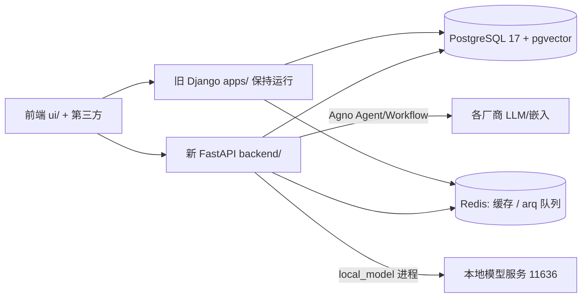
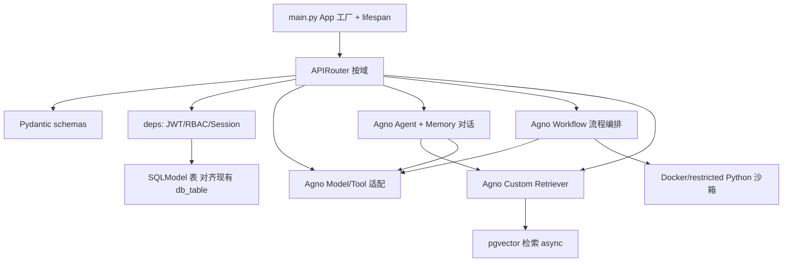

## 用户需求

将 MaxKB 后端从 Django 5.2 + DRF + LangChain 重构为独立的 FastAPI + SQLModel + Agno（最新稳定版，Python 3.11）新服务。新建 `backend/` 目录（与 `apps/`、`ui/` 并列），不修改现有 `apps/` 代码，旧 Django 服务保持可运行。纯代码重构，不涉及网关切流或灰度。

## 核心约束

1. **优先 Agno 原生能力**：对话用 `agno.agent.Agent`（配 `agno.memory` 实现长期记忆）、多步编排用 `agno.workflow.Workflow`、模型用 `agno.models.*`、工具用 `agno.tools.*`、检索用 Agno Custom Retriever。减少自研适配层，直接复用 Agno 自带能力。
2. **空 Alembic 基线 + 禁用 create_all**：首次迁移为手工写 `0001_empty.py`（`upgrade()` 仅 `pass`），`alembic upgrade head` 仅 stamp 版本状态；`db.py` 只建 asyncpg 引擎与 session 依赖，绝不调用 `create_all()`。后续增量迁移禁 `drop_`（drop_table/drop_column）与列类型变更。
3. **CI 迁移门禁**：CI 自动扫描 `backend/alembic/versions/*.py`，正则匹配 `drop_`（DropTableOp/DropColumnOp/`op.drop_*`）与列类型变更（`alter_column` 含 `type_`/`existing_type`）；命中即 fail，须人工 review 放行后才能合入。
4. **Agno Custom Retriever 适配 pgvector**：RAG 检索实现为 Agno `retriever`（自定义 Retriever），内部复用现有 `apps/knowledge/vector/` 的 pgvector 检索 SQL（搬到 asyncpg），不改用 Agno 自带 PgVector 重写，以保持与现有 `paragraph`/`embedding` 表兼容。
5. **仅重构代码，不切流**：去掉所有网关切流/灰度设计，只产出新 `backend/` 代码；新旧服务共享同一 PostgreSQL/pgvector/Redis，数据保留靠 SQLModel 表严格对齐而非双写。
6. **版本约束**：agno 使用最新稳定版（实现时用 uv 固定当时最新版）；Python 3.11。

## Review 发现并已修正的缺失/模糊点

- **local_model 独立进程架构**：新增 `main_local_model.py` 入口，通过 `SERVER_NAME=local_model` 环境变量切换 profile 仅加载模型服务相关路由。
- **folders mptt 树形结构**：SQLModel 无 mptt 等价物 → 改用**邻接表**（`parent_id`）+ PostgreSQL `WITH RECURSIVE` CTE 自实现树查询，`models/folders.py` 仅存 `parent_id` 字段。
- **Alembic 基线生成描述错误**：修正为手工写空迁移（不用 `--autogenerate`），仅 stamp 版本；后续修改 SQLModel 时才用 `--autogenerate` 生成增量迁移。
- **Agno 原生覆盖度验证**：新增阶段 0 前置验证，安装 agno 后扫描当前支持的 model provider 清单，对照 `models_provider/impl/` 标记"Agno 原生覆盖"与"需自研适配"，明确降级边界。
- **asyncpg 连接池对照**：补充 Django → asyncpg 参数映射表（POOL_SIZE→min/max_size，RECYCLE→max_inactive_connection_lifetime，PRE_PING→pre_ping，TIMEOUT→command_timeout）。
- **SSE 流式对话**：明确流式用 FastAPI `StreamingResponse` + Agno `astream_events()`，优先 SSE 而非 WebSocket。
- **system_manage 表**：补 `models/system.py`；**沙箱执行**在 workflows 阶段沿用 Docker/restricted Python 沙箱。
- **定时任务清单**：在 infra-core 阶段扫描原有 celery-beat PeriodicTask 注册，生成 arq cron 迁移清单。

## 技术栈选型

| 层 | Django（旧，保留不动） | FastAPI（新 `backend/`） |
| --- | --- | --- |
| Web 框架 | Django 5.2.14 | FastAPI（ASGI）+ Uvicorn / Gunicorn(UVicornWorker) |
| REST API | DRF 3.17.1 + drf-spectacular | FastAPI 原生 OpenAPI + Pydantic schemas |
| ORM | Django ORM + psycopg | **SQLModel**（`table=True`），异步引擎 **asyncpg** |
| 迁移 | Django migrations | **Alembic**（手工空基线 + 仅加法增量） |
| 配置 | apps/maxkb/conf.py ConfigManager | **pydantic-settings**（兼容 `MAXKB_*` + `SERVER_NAME` + `config.yml`） |
| 智能体 | LangChain + LangGraph + deepagents | **Agno**（Agent / Workflow / Model / Tool / Memory / Retriever） |
| 异步/队列 | Celery 5.5.3 + beat + once + apscheduler | **arq**（Redis 轻量队列 + cron） + FastAPI BackgroundTasks |
| 缓存 | django-redis | redis-py（async） |
| 向量 | pgvector（经 Django ORM） | pgvector 经 asyncpg（Custom Retriever 内直接执行嵌入检索 SQL） |
| 安全 | Django auth | FastAPI OAuth2PasswordBearer + JWT（PyJWT）+ RBAC 依赖 |
| i18n | gettext + polib | 沿用 polib / gettext（复用 `locales/`） |
| 工程 | uv + ruff(120) | uv + ruff(120) + pytest + httpx（AsyncClient）；独立 `backend/pyproject.toml` |


## 实现策略（高层）

新建独立 `backend/`，直连同一 PostgreSQL/pgvector 与 Redis，与旧 Django **共享数据**（不做双写）。关键决策：

1. **SQLModel 表对齐现有 PG 表**：SQLModel 的 `__tablename__` / 列（类型、nullable、default）必须与 `apps/*/models/*.py` 的 `db_table` 及字段严格一致，使用 `sa_column` 显式声明。这是数据保留的核心手段。

2. **手工空 Alembic 基线**：写 `0001_empty.py`（`upgrade()` 仅 `pass`），`alembic upgrade head` 仅 stamp 版本到 alembic_version 表。不依赖 `create_all()`（db.py 中禁用），不生成 DDL。后续修改 SQLModel 时才用 `--autogenerate` 生成增量迁移。

3. **Agno 原生优先**：阶段 0 先验证 Agno 当前支持的 model provider 范围，最大化使用 agno.models.*。仅对 Agno 不支持且 Django 现有 impl/ 中有实现的厂商保留轻量适配层。

4. **去 Celery，用 arq**：长任务（嵌入/索引/定时）用 arq（Redis 队列 + cron），短任务用 FastAPI BackgroundTasks。全程 async（asyncpg、httpx、redis async）。arq cron 任务清单从扫描旧 celery-beat PeriodicTask 注册获得。

5. **local_model 独立进程**：新增 `main_local_model.py`，通过 `SERVER_NAME=local_model` 加载精简 FastAPI 实例（仅模型服务路由），绑定 `LOCAL_MODEL_HOST:PORT`。

6. **mptt 树用邻接表 + PG 递归 CTE**：SQLModel `Folders` 表存 `parent_id`，树查询用 PostgreSQL `WITH RECURSIVE` 在 raw SQL 层实现，不引入额外库。

## 架构设计

### 运行时拓扑（共享 PG/Redis）



### 新服务内部分层



### local_model 独立进程

```
backend/main_local_model.py  →  SERVER_NAME=local_model
  ├── 加载 core/config.py（读取 LOCAL_MODEL_HOST:PORT）
  ├── 挂载仅模型服务的 router 子集
  └── uvicorn 绑定 LOCAL_MODEL_HOST:LOCAL_MODEL_PORT
```

## 目录结构

```
backend/                        # [NEW] 与 apps/、ui/ 并列，不修改 apps/
├── pyproject.toml              # uv 依赖：fastapi/uvicorn/sqlmodel/agno[latest]/alembic/asyncpg/arq/redis/pydantic-settings/pyjwt/python-jose/pgvector/polib/pytest/httpx/ruff
├── alembic.ini                 # target_metadata = app.core.db.SQLModel.metadata
├── alembic/
│   ├── env.py                  # 连接同一 PG（asyncpg），禁用 create_all
│   └── versions/
│       └── 0001_empty.py       # [手工写] upgrade() 仅 pass，降级 pass，仅 stamp 版本
├── main.py                     # web 入口：SERVER_NAME=web；App 工厂+lifespan(引擎/redis/arq)
├── main_local_model.py         # local_model 独立入口：SERVER_NAME=local_model，精简路由
├── scripts/
│   └── check_migrations.py     # CI 门禁：扫描 drop_ 与列类型变更
├── .github/workflows/ci.yml    # CI：ruff + pytest + check_migrations
└── app/
    ├── core/
    │   ├── config.py           # pydantic-settings：兼容 MAXKB_*/SERVER_NAME/SANDBOX_PYTHON_PACKAGE_PATHS + config.yml
    │   ├── db.py               # asyncpg 引擎 + session 依赖；仅建引擎（禁 create_all）；pool 对照映射
    │   ├── redis.py            # async redis 客户端
    │   ├── security.py         # JWT/OAuth2PasswordBearer + RBAC 依赖注入
    │   ├── tasks.py            # arq 封装 + cron（来自 celery-beat 扫描清单）+ BackgroundTasks
    │   └── i18n.py             # polib/gettext 兼容
    ├── models/
    │   ├── base.py             # 公共字段：id, created_at, updated_at
    │   ├── user.py             # 对齐 user / user_group / 权限表
    │   ├── knowledge.py        # 对齐 knowledge/document/paragraph/problem/embedding/file/tag
    │   ├── application.py      # 对齐 application/application_chat
    │   ├── tool.py             # 对齐 tool/tool_workflow
    │   ├── trigger.py          # 对齐 event_trigger
    │   ├── folders.py          # 邻接表（parent_id），树查询用 PG WITH RECURSIVE
    │   └── system.py           # 系统配置/许可证表
    ├── schemas/                # 请求/响应 Pydantic
    ├── api/                    # APIRouter：users/knowledge/application/chat/tools/system/trigger
    ├── providers/              # Agno Model/Tool 适配
    │   ├── base.py             # 凭据校验/加密(对齐 BaseModelCredential) + 轻量注册
    │   ├── openai.py           # agno.models.openai.OpenAIChat
    │   ├── anthropic.py
    │   └── ...                 # 原生用 agno.models.*，自研保留适配
    ├── rag/
    │   ├── parsers.py          # 沿用 pypdf/docx/openpyxl/bs4 解析
    │   ├── splitter.py         # 文本拆分
    │   ├── embed.py            # 调用 providers 嵌入（经 arq 异步）
    │   ├── retriever.py        # Agno Custom Retriever，内部执行 pgvector 检索 SQL
    │   └── pipeline.py         # 解析→拆分→嵌入→入库 编排
    ├── agents/
    │   └── chat_agent.py       # agno.agent.Agent + agno.memory；SSE 流式（StreamingResponse+astream_events）
    ├── workflows/
    │   ├── engine.py           # Agno Workflow 执行器
    │   └── step_nodes/         # 先 LLM/知识/工具/条件，再补齐 146 step_node
    └── tests/                  # pytest + httpx AsyncClient + Alembic 测试库
```

## 关键代码结构（接口级）

### SQLModel 表对齐约束（sa_column 显式声明）

```python
from sqlmodel import SQLModel, Field
from sqlalchemy import Column, String, Text, DateTime, func

class Knowledge(SQLModel, table=True):
    __tablename__ = "knowledge"        # 严格对齐 Django db_table
    id: str = Field(primary_key=True)
    name: str = Field(sa_column=Column(String(128), nullable=False))
    description: str | None = Field(sa_column=Column(Text, nullable=True))
    created_at: datetime = Field(sa_column=Column(DateTime, server_default=func.now()))
    # 其余字段逐一对照 apps/*/models/*.py，确保类型/nullable/default 一致
```

### Agno Custom Retriever（复用 pgvector 检索）

```python
from agno.retriever import Retriever

class PgVectorRetriever(Retriever):
    def search(self, query: str, top_k: int = 5, **kwargs) -> list[dict]:
        # 内部执行现有 paragraph/embedding 表 pgvector 余弦检索 SQL（asyncpg）
        ...
```

### Provider 凭据校验（对齐 BaseModelCredential）

```python
class IModelProvider:
    def get_model(self, model_type: str, model_name: str, credential: dict):
        # 返回 agno Model 实例（agno.models.openai.OpenAIChat 等）
        ...
    def is_valid_credential(self, model_type, model_name, credential, raise_exception=False) -> bool:
        ...  # 对齐 BaseModelCredential.is_valid，含 encryption_dict 语义
```

### asyncpg 连接池参数对照

| Django (dj_db_conn_pool) | asyncpg | 说明 |
| --- | --- | --- |
| POOL_SIZE=20 | min_size=10, max_size=20 | asyncpg 分离了最小/最大连接数 |
| MAX_OVERFLOW=80 | 含于 max_size | asyncpg 连接池已包含 overflow |
| RECYCLE=1800 | max_inactive_connection_lifetime=1800 | 到期后自动回收 |
| PRE_PING=True | pre_ping=True | 连接前 ping 检测有效性 |
| TIMEOUT=30 | command_timeout=30 | sql 执行超时 |


## 实现注意（防回归）

- **绝不修改 `apps/`**：所有新增代码在 `backend/`。
- **字段对齐优先**：SQLModel 列用 `sa_column` 显式指定，逐表核对核心表（user / knowledge / document / paragraph / problem / embedding / file / tool / event_trigger / application / folders / system）。
- **迁移安全规则**：增量迁移仅允许 `add_column`（新增可选列、加 ivfflat/hnsw 索引）；禁 `drop_table`/`drop_column`/列类型变更。
- **CI 门禁脚本**：`scripts/check_migrations.py` 扫描 alembic/versions/*.py，正则匹配 drop_ 与列类型变更，命中直接 fail；pre-commit 集成同一脚本。
- **日志风格**：复用现有模块名 `maxkb.*`；密钥不落明文（encryption_dict 等价处理）。
- **库与表前缀**：所有库（Redis DB、PG search_path）保持与 Django 一致，避免命名冲突。

## Agent Extensions

### SubAgent

- **code-explorer**
- Purpose：在阶段 2 "表对齐"中逐表核对 `apps/*/models/*.py` 的 `db_table` 与字段定义，生成 SQLModel 对齐清单；枚举 `models_provider/impl/` 各厂商实现与 `flow/step_node/` 全部节点类型。
- Expected outcome：产出三份映射表——(a) 现有 Django Model 表名/字段 → SQLModel 定义；(b) 厂商 impl 文件 → Agno Model 原生支持 / 需自研适配；(c) flow step_node 文件列表 → Agno Workflow 步骤类型，作为后续阶段实现的精准清单。