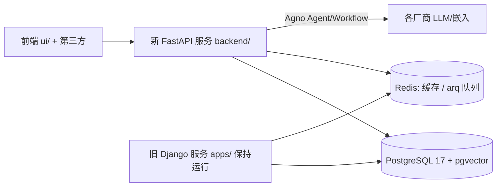
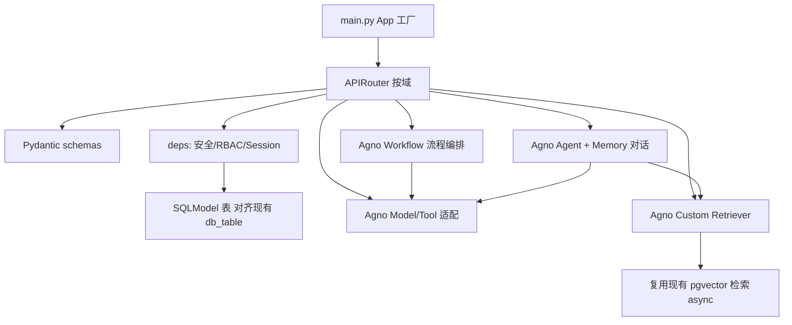

## 用户需求

将 MaxKB 后端从 Django 5.2 + DRF + LangChain 重构为 **FastAPI + SQLModel + Agno** 新服务，产出可落地的代码重构方案（纯代码重构，不涉及网关切流/灰度）。

## 本轮新增硬约束（用户明确）

1. **优先使用 Agno 框架原生能力**：对话用 `agno.agent.Agent`、多步编排用 `agno.workflow.Workflow`、模型用 `agno.models.*`、工具用 `agno.tools.*`、记忆用 `agno.memory`、检索用 Agno `retriever`；尽量减少自研适配层，直接复用 Agno 自带能力。
2. **空 Alembic 基线 + 禁用 create_all**：首次迁移必须为空（仅 `stamp` 版本状态，不建表）；`backend/app/core/db.py` 只创建异步引擎与 session 依赖，**绝不调用 `create_all()`**；后续增量迁移脚本不得包含 `drop_` 或列类型变更（alter column type-change）。
3. **CI 迁移门禁**：CI 自动扫描 `backend/alembic/versions/*.py`，任何 `drop_`（如 `drop_table`/`drop_column`/`op.drop_*`）或列类型变更均使构建失败，须人工确认后才能合入。
4. **Agno Custom Retriever 作为 RAG 适配层**：RAG 检索实现为 Agno `retriever`（自定义 Retriever），内部**复用现有 `apps/knowledge/vector/` 的 pgvector 检索逻辑**（搬到 async），不改用 Agno 自带 PgVector 重写，以保证与现有 `paragraph`/`embedding` 表兼容。
5. **仅重构代码，不考虑切流**：去掉所有网关切流/灰度设计，只产出新 `backend/` 代码；新旧服务共享同一 PostgreSQL/pgvector/Redis，数据保留靠 SQLModel 表结构严格对齐而非双写。
6. **版本约束**：agno 使用最新稳定版（实现时用 uv 固定当时最新版，以实际 API 为准）；Python 3.11。

## 已确认边界（仍有效）

- 并行新服务：新建独立 `backend/`（与 `apps/`、`ui/` 并列），不修改 `apps/` 现有代码，旧 Django 保持可运行。
- `models_provider` → Agno Model/Tool；`flow`（181 文件）→ Agno Workflow 重写；`knowledge` RAG/pgvector 解析与检索 → 沿用；`Celery` → 不保留，用 FastAPI async + arq 轻量队列替代；保留 PostgreSQL + pgvector + Redis 底座。

## 技术栈选型

- **Web 框架**：FastAPI（ASGI，原生 async）+ Uvicorn；部署 Gunicorn(UvicornWorker)。
- **ORM**：SQLModel（`table=True`），异步引擎 **asyncpg**；迁移用 **Alembic**（空基线 + 仅加法增量）。
- **智能体框架**：**Agno（最新稳定版）**——Agent / Workflow / Model / Tool / Memory / Knowledge / Retriever 全部优先使用其原生能力。
- **配置**：pydantic-settings，兼容现有 `MAXKB_*` 环境变量与 `SERVER_NAME`（`web`/`local_model`）。
- **缓存/向量/队列**：Redis（async，redis-py）作缓存与 **arq** 轻量任务队列（替代 Celery，支持 cron）；pgvector 经 asyncpg 直接访问（在 Custom Retriever 内复用现有检索 SQL）。
- **RAG 解析（沿用）**：pypdf / python-docx / openpyxl / beautifulsoup4 / markdownify / sentence-transformers / torch / jieba。
- **安全**：FastAPI `OAuth2PasswordBearer` + JWT（PyJWT/python-jose）+ RBAC 依赖（映射 user 表）。
- **i18n**：polib + gettext（沿用 `locales/`）。
- **工程**：uv 包管理、ruff(120)、pytest + httpx(AsyncClient)；独立 `backend/pyproject.toml`；Python 3.11。

## 实现策略

新建独立 `backend/`（与 `apps/`、`ui/` 并列），直连**同一 PostgreSQL/pgvector 与 Redis**，与旧 Django 共享数据。由于新旧服务操作同一批表，"数据平滑迁移"的本质是 **SQLModel 表的 `__tablename__`/列（类型/nullable/default）必须与现有 `apps/*/models/*.py` 的 `db_table` 及字段严格对齐**，而非双写。

1. **空 Alembic 基线**：定义好 SQLModel 后运行 `alembic revision --autogenerate` 得到近乎空的初始迁移，`upgrade()` 仅 `pass`，`alembic upgrade head` 只 stamp 版本；`backend/app/core/db.py` 只建 asyncpg 引擎与 session 依赖，**禁用 `create_all()`**，避免误建/改列。
2. **Agno 原生优先**：对话用 `agno.agent.Agent`（配 `agno.memory` 实现长期记忆）；多步编排用 `agno.workflow.Workflow`；模型用 `agno.models.*`；工具用 `agno.tools.*` / 函数调用；RAG 检索用 **Agno Custom Retriever**，内部调用搬到 async 的现有 pgvector 查询，供 Agent 的 `knowledge`/retrieval 使用。
3. **去 Celery**：长任务（嵌入/索引/定时）用 **arq**（Redis 轻量队列 + cron），短任务用 FastAPI `BackgroundTasks`；全程 async（asyncpg、httpx、redis async）。
4. **性能**：嵌入批量并发；pgvector 检索加 ivfflat/hnsw 索引（增量迁移允许加索引）；连接池复用。

## 实现注意（防回归）

- **绝不修改 `apps/`**：所有新增代码在 `backend/`；旧服务保持可运行。
- **字段对齐优先**：SQLModel 列用 `sa_column` 显式指定类型/nullable/default，逐一对照 Django 定义；对 `user`/`application`/`knowledge`/`document`/`paragraph`/`problem`/`embedding`/`file`/`tool`/`event_trigger` 等核心表逐表核对。
- **迁移安全规则**：增量迁移只允许 `add_column`（新增可选列、加索引）；禁止 `drop_table`/`drop_column`、禁止列类型变更（`alter_column` 改 type）。
- **CI 迁移门禁**：在 CI（或 pre-commit）加检查脚本，扫描 `backend/alembic/versions/*.py`，正则匹配 `drop_`（DropTableOp/DropColumnOp/`drop_table`/`drop_column`/`op.drop_*`）与列类型变更（`alter_column` 含 `type_`/`existing_type`/`existing_type`）；命中即 fail，需人工 review 放行。
- **日志与安全**：复用现有日志风格（模块名 `maxkb.*`）；密钥经等价现有 `encryption_dict` 逻辑处理，不落明文。

## 架构设计

目标运行时（共享同一 PG/pgvector/Redis，纯代码、无切流）：



新服务内部分层（优先 Agno 原生能力）：



## 目录结构（新建 `backend/`，不改动 `apps/`）

```
backend/
├── pyproject.toml              # [NEW] uv 依赖(fastapi/sqlmodel/agno[latest]/alembic/asyncpg/arq/redis/pydantic-settings/pyjwt/python-jose/pgvector/polib/pytest/httpx/ruff)，Python 3.11 独立环境
├── alembic.ini                 # [NEW] Alembic 配置，target_metadata=SQLModel.metadata
├── alembic/
│   ├── env.py                  # [NEW] 连接同一 PG，target_metadata=SQLModel.metadata
│   └── versions/
│       └── 0001_empty.py       # [NEW] 空基线：upgrade() 仅 pass，仅 stamp 版本
├── scripts/
│   └── check_migrations.py     # [NEW] CI 门禁：扫描 drop_ 与列类型变更，命中即失败
├── .github/workflows/ci.yml    # [NEW] 门禁：ruff + pytest + check_migrations
└── app/
    ├── main.py                 # [NEW] FastAPI 工厂：lifespan(引擎/redis/arq)、挂载 router、CORS
    ├── core/
    │   ├── config.py           # [NEW] pydantic-settings，兼容 MAXKB_*/SERVER_NAME，映射 DB/Redis/本地模型
    │   ├── db.py               # [NEW] asyncpg 引擎 + session 依赖；【仅建引擎，禁用 create_all】
    │   ├── redis.py            # [NEW] async redis 客户端
    │   ├── security.py         # [NEW] JWT/OAuth2 + RBAC 依赖（映射 user 表）
    │   ├── tasks.py            # [NEW] arq 封装（替代 Celery）：嵌入/索引/定时
    │   └── i18n.py             # [NEW] polib/gettext 兼容
    ├── models/                 # [NEW] SQLModel 表，__tablename__ 严格对齐现有 db_table
    │   ├── base.py             # [NEW] 公共字段(id/created_at/updated_at)
    │   ├── user.py             # [NEW] 对齐 user / user_group / 权限
    │   ├── knowledge.py        # [NEW] 对齐 knowledge/document/paragraph/problem/embedding/file/tag
    │   ├── application.py      # [NEW] 对齐 application/application_chat
    │   ├── tool.py             # [NEW] 对齐 tool/tool_workflow
    │   └── trigger.py          # [NEW] 对齐 event_trigger
    ├── schemas/                # [NEW] 请求/响应 Pydantic（替代 DRF serializer）
    ├── api/                    # [NEW] APIRouter 按域：users/knowledge/application/chat/tools/system/trigger
    ├── providers/              # [NEW] Agno Model/Tool 适配层（搬运 impl/）
    │   ├── base.py             # [NEW] 轻量注册 + 凭据校验/加密(对齐 BaseModelCredential)
    │   ├── openai.py
    │   ├── anthropic.py
    │   └── ...                 # 各厂商逐一端口为 agno.models.*
    ├── rag/                    # [NEW] knowledge 异步流水线
    │   ├── parsers.py          # [NEW] 沿用 pypdf/docx/openpyxl/bs4 解析
    │   ├── splitter.py         # [NEW] 文本拆分
    │   ├── embed.py            # [NEW] 调用 providers 嵌入（经 arq 异步）
    │   ├── retriever.py        # [NEW] Agno Custom Retriever，内部复用现有 pgvector 检索(async)
    │   └── pipeline.py         # [NEW] 编排（解析→拆分→嵌入→入库）
    ├── agents/                 # [NEW] Agno Agent 重写 chat_pipeline + long_term_memory
    │   └── chat_agent.py       # [NEW] agno.agent.Agent + agno.memory
    ├── workflows/              # [NEW] Agno Workflow 重写 flow 引擎
    │   ├── engine.py           # [NEW] 工作流执行器
    │   └── step_nodes/         # [NEW] 各节点(先最小子集: LLM/知识/工具/条件)
    └── tests/                  # [NEW] pytest + httpx AsyncClient + Alembic 测试库
```

## 关键代码结构（接口级，仅示意对齐约束）

SQLModel 必须显式对齐现有 `db_table` 与列，避免 Alembic 误迁移（`db.py` 禁用 `create_all`）：

```python
from sqlmodel import SQLModel, Field
from sqlalchemy import Column, String, Text

class Knowledge(SQLModel, table=True):
    __tablename__ = "knowledge"          # 严格对齐 apps/knowledge/models/knowledge.py 的 db_table
    id: str = Field(primary_key=True)
    name: str = Field(sa_column=Column(String(128), nullable=False))
    # 其余字段逐一对照现有 Model 定义，确保类型/nullable/default 一致
```

Agno Custom Retriever 适配层，复用现有 pgvector 检索逻辑（接口级）：

```python
from agno.retriever import Retriever

class PgVectorRetriever(Retriever):
    # 内部调用搬到 async 的现有 apps/knowledge/vector/ 检索 SQL
    def add(self, *args, **kwargs): ...
    def search(self, query: str, top_k: int = 5, **kwargs) -> list[dict]:
        # 复用 paragraph/embedding 表的 pgvector 余弦检索，返回 chunk 列表
        ...
```

Provider 适配层保留原 `BaseModelCredential` 的校验与加密语义（接口级）：

```python
class IModelProvider:
    def get_model(self, model_type: str, model_name: str, credential: dict):
        ...  # 返回 Agno Model 实例（如 agno.models.openai.OpenAIChat），沿用原 new_instance 逻辑
    def is_valid_credential(self, model_type, model_name, credential, raise_exception=False) -> bool:
        ...  # 对齐 BaseModelCredential.is_valid
```

## Agent Extensions

### SubAgent

- **code-explorer**
- Purpose: 在阶段 1 大规模映射现有代码——逐表核对 `apps/*/models/*.py` 的 `db_table` 与字段（生成 SQLModel 对齐清单），枚举 `models_provider/impl/` 各厂商实现与 `flow/step_node/` 全部节点类型，输出待端口清单。
- Expected outcome: 产出"现有表→SQLModel 映射表""厂商 impl→Agno Model 映射表""flow 节点→Agno Workflow 步骤映射表"，为后续逐模块实现提供精准清单，避免遗漏或字段错位导致数据风险。