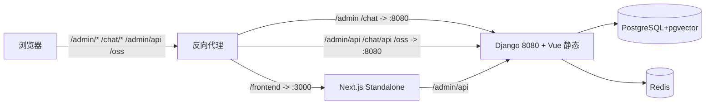

## 用户需求

基于已确认的设计文档 `docs/前端Next.js化改造设计方案.md`，在仓库根**新增独立工程 `frontend/`**，用 Next.js（App Router）+ React + Ant Design 实现对标原 Vue admin 的管理后台；原 `ui/`（Vue admin + Vue chat）、`main.py`、后端代码**一律不改**。

## 产品概述

`frontend/` 是独立部署（独立 Node 进程）的企业级管理控制台，以 `basePath: '/frontend'` 挂载，通过反向代理与现有 `/admin`、`/chat`（Vue）共存，复用 Django 现有认证与 `/admin/api` 接口。

## 核心特性

- 新建独立 Next.js 工程，与 `ui/`、`apps/` 零耦合，不改动任何现有文件。
- 阶段 0/1 落地：脚手架 + 核心基础设施（请求层、状态、i18n、主题、布局、路由守卫、部署配置）+ 可对接真实 `/admin/api` 的登录页与首页骨架。
- 鉴权与 Vue 完全一致：token 存 `localStorage`（`token` key），并同步写入非 httpOnly cookie `MAXKB-TOKEN` 供 `middleware.ts` 做路由保护。
- Ant Design 经 `@ant-design/nextjs-registry` 解决 SSR 样式注水；主题色经 `ConfigProvider` token 动态注入。
- 后续业务域（知识库/模型/应用/工作流等）按"新建式"移植，本次仅保留目录与布局占位。

## 技术栈选型

- 框架：Next.js 15（App Router，`output: 'standalone'`，`basePath: '/frontend'`），React 19，TypeScript。
- UI：Ant Design v5 + `@ant-design/nextjs-registry`（SSR 样式注水）。
- 状态：Zustand（替代 Pinia，含 `persist` 中间件）。
- 国际化：next-intl（复用 Vue 现有 key，不重翻文案）。
- 请求：axios（拦截器逻辑平移自 `ui/src/request/index.ts`）。
- 工具：`ahooks`、`nprogress`、`dayjs` 等。

## 实现方案

**总体策略**：在仓库根新建 `frontend/`（采用 `src/` 目录约定：`src/app`、`src/lib`、`src/store`、`src/components`、`src/i18n`，根置 `messages/`）。保留绝对路径 `/admin/api` 调用（不经 basePath），由 `next.config` rewrites 代理到 Django 8080；页面路由统一挂在 `/frontend` 下。

**关键决策与权衡**

1. **鉴权双存储**：Vue 将 token 存 `localStorage('token')`。React 侧 axios 沿用相同读取方式以保持契约一致；同时登录成功后把 token 写入非 httpOnly cookie `MAXKB-TOKEN`，`middleware.ts` 读取该 cookie 做边缘路由保护（避免 SSR 期读不到 localStorage）。客户端管理布局再加一层 localStorage 兜底守卫，防首屏越权。
2. **rewrites 加 `basePath:false`**：有 `basePath` 时 rewrite 的 `source` 会自动叠加前缀，导致 `/admin/api` 变 `/frontend/admin/api`；逐条加 `basePath:false` 才能正确代理（已审查修正）。包含 `/admin/api`、`/chat/api`、`/oss`、`/doc`、`/schema`、`/static`。
3. **middleware matcher 不含 `/frontend` 前缀**：Next 匹配 matcher 前会先剥离 basePath，故用 `matcher: ['/((?!_next|api|static|favicon).*)']`；注意 `req.nextUrl.pathname` 仍含 `/frontend` 前缀。
4. **SSR 样式**：根布局用 `AntdRegistry` 包裹 `ConfigProvider`，避免 AntD 样式闪烁。
5. **请求层平移**：`baseURL: '/admin/api'`，请求拦截器注入 `AUTHORIZATION: Bearer <token>` 与 `Accept-Language`；响应拦截器对 `code!==200` 提示错误、401 跳登录、403 提示无权限、404 跳错误页；保留 `get/post/put/del`、`postStream`(fetch)、`exportFile/exportExcel`(blob 下载) 等封装。

**性能与可靠性**

- AntD Registry 消除样式闪烁；工作流等重组件后续用 `dynamic(ssr:false)` 懒加载（本次不实现）。
- 登录态 cookie 仅作路由保护用途，业务请求统一走 localStorage，与 Vue 行为一致，降低回归风险。
- 所有新文件置于 `frontend/`，`ui/` 与后端零改动，回滚只需删除该目录。

## 架构设计

### 部署拓扑（与现有共存）



### 目录结构（本次全部为新增）

```
frontend/                                  # [NEW] 独立 Next.js 工程
├── src/
│   ├── app/
│   │   ├── layout.tsx                     # [NEW] 根布局：AntdRegistry + NextIntlClientProvider
│   │   ├── (admin)/
│   │   │   ├── layout.tsx                 # [NEW] 后台壳：侧边栏+顶栏+客户端守卫
│   │   │   ├── login/page.tsx             # [NEW] 登录页（对接 /admin/api/user/login）
│   │   │   └── home/page.tsx              # [NEW] 工作台骨架
│   │   └── 404/page.tsx                   # [NEW] 未找到页
│   ├── components/                        # [NEW] AppShell / LocaleSwitch / ThemeToggle
│   ├── lib/
│   │   ├── request/index.ts              # [NEW] axios 封装（对齐 Vue 拦截器）
│   │   ├── request/Result.ts             # [NEW] 统一返回结构
│   │   ├── constants.ts                   # [NEW] 常量（basePath、登录路径、locale key）
│   │   ├── utils/message.ts              # [NEW] AntD message 封装
│   │   └── api/                           # [NEW] 业务接口占位（login 等）
│   ├── store/                             # [NEW] Zustand：login/user/theme/common + index
│   └── i18n/                              # [NEW] next-intl routing.ts / request.ts
├── messages/                              # [NEW] zh.json / en.json（骨架 key，复用 Vue key）
├── middleware.ts                          # [NEW] 读 cookie MAXKB-TOKEN 做路由保护
├── next.config.mjs                        # [NEW] basePath:/frontend + rewrites(basePath:false)
├── package.json / tsconfig.json / .env / .env.local / next-env.d.ts
├── Dockerfile                             # [NEW] standalone 多阶段构建
├── nginx.conf.example                     # [NEW] 路径分流示例
└── README.md                              # [NEW] 启动/构建/部署说明
```

## 设计风格

采用 Ant Design v5 的企业级后台风格（Enterprise / Clean / Material / Card-based），蓝色主色、左侧可折叠侧边栏 + 顶部全局栏框架。浅色为主、支持暗色主题（ConfigProvider token）。保留表格/表单/弹窗/抽屉/标签页等标准后台组件，信息层级与原 Vue admin 一致。

## 页面区块

- 登录页：居中卡片表单，品牌标题、账号密码、语言切换、主题切换。
- 后台壳：左侧菜单分组（工作台/知识库/模型/应用/工具/触发器/系统）、顶部全局栏（用户头像下拉、语言切换、明暗切换、全屏）、内容区。
- 首页骨架：统计卡片 + 快捷入口占位。