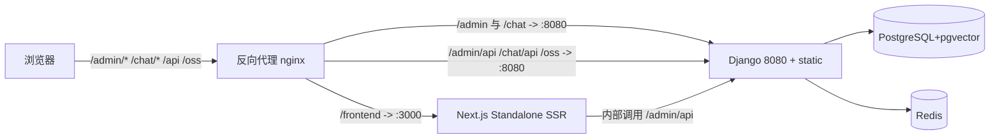

## 用户需求

在完全不改动现有 `ui/`（Vue admin + Vue chat）、`main.py`、以及 `apps/maxkb` 后端任何代码的前提下，于仓库新增一个**独立的前端模块 `frontend/`**，用 Next.js + React + Ant Design 实现对标原 admin 管理后台的管理控制台。

## 产品概述

该新模块是一个独立部署（独立 Node 进程）的企业级管理控制台，功能对标原 Vue admin：登录、工作台、系统设置、模型提供方、知识库/文档/段落、智能体应用、工具库、触发器，以及基于 LogicFlow 的工作流编排。它通过反向代理以独立路径 `/frontend` 对外提供服务，并复用 Django 现有的认证与 `/admin/api` 接口。原 Vue admin（`/admin`）与 Vue chat（`/chat`）完全保留、互不影响。

## 核心特性

- 新增独立 Next.js（App Router）工程 `frontend/`（与 `ui/`、`apps/` 并列，零耦合），路径 `/frontend` 与 `/admin`、`/chat` 不冲突。
- 用 Zustand 替代 Pinia、next-intl 替代 vue-i18n、Ant Design 替代 Element Plus，组件与文案 key 一一映射。
- 复用现有 axios 请求层与拦截器逻辑，经 `next.config` rewrites 指向 Django 8080。
- 用 `dynamic(import, { ssr:false })` 客户端加载 LogicFlow 工作流编辑器。
- 登录态通过同域 cookie 复用 Django 认证；原 Vue admin / chat 完全不受影响。
- 本次仅产出《新增 Next.js 前端模块架构设计方案》文档，不实际写代码。

## 关于 basePath

basePath 是 Next.js 的部署路径前缀配置（`next.config` 中的 `basePath`）。将其设为 `/frontend` 后，Next 内部的所有路由与静态资源（JS/CSS/图片）都会自动加上 `/frontend` 前缀（如 `/frontend/login`、`/frontend/_next/...`），使应用整体挂载在 `/frontend` 之下，从而与现有 `/admin`、`/chat` 路径互不冲突。而业务接口仍显式请求 `/admin/api`（不叠加 basePath），并经 rewrites 代理到 Django 8080，复用现有后端 API。

## 技术栈选型

- 框架：Next.js（App Router，`output:'standalone'`，`basePath:'/frontend'`），React 18+，TypeScript。
- UI 组件库：Ant Design v5，配合 `@ant-design/nextjs-registry` 解决 SSR 样式注水。
- 状态管理：Zustand（轻量、贴合 React hooks，替代 Pinia）。
- 国际化：next-intl（替代 vue-i18n，保留现有 key 不变）。
- 请求：axios（平移现有封装）+ fetch（SSE/流式）+ 原生 WebSocket。
- 工作流：`@logicflow/core` + `@logicflow/extension`（框架无关，React 侧 `useRef`+`useEffect` 封装）。
- 样式：Sass Modules + AntD `theme.token` 主题注入。
- 第三方库替代：md-editor-v3→`@mdxeditor/react`（或 `md-editor-rt`）、vue-codemirror→`@uiw/react-codemirror`、sortablejs/vue-draggable-plus→`@dnd-kit`、echarts→`echarts-for-react`、cropperjs→`react-cropper`、jsencrypt/mermaid/highlight.js/katex 通用直用、vueuse→`ahooks`。

## 实现方案

**总体策略**：在仓库根新增独立工程 `frontend/`（与 `ui/`、`apps/` 并列，零耦合、零改动现有代码）。新模块以 Next standalone 单实例提供 SSR，由反向代理（nginx 首选，零后端改动）按路径分流：`/admin`、`/chat` 仍由 Django(:8080) 托管 Vue；`/frontend` 指向 Next(:3000)；所有 `/admin/api`、`/chat/api`、`/oss` 转发 Django(:8080)。登录态通过同域 cookie（token）复用现有认证。

**关键决策与权衡**：

1. **独立模块 + 独立路径，而非改写现有 admin**：用户明确要求 `ui/` 不变，且后端静态托管按 `/admin` 路由，故新模块必须用 `basePath:'/frontend'` 规避冲突，独立部署互不干扰。
2. **nginx 分流而非改 Django 路由**：现有 `apps/maxkb/urls/web.py` 的 `prefix`/`chatPrefix` 运行时 HTML 替换逻辑只作用于 `ui/` 的 Vue `index.html`，新模块用 Next `basePath` + 构建期注入，无需触碰后端。
3. **SSR 鉴权**：用 `middleware.ts` 平移原 `router.beforeEach`（无 token 跳 `/login`、401 跳登录）；客户端组件保留 axios 直连 `/admin/api` 并携带同域 cookie。
4. **LogicFlow 客户端隔离**：编辑器依赖 DOM/画布，必须 `dynamic(import, { ssr:false })` 客户端加载，避免 SSR 报错。
5. **API 层复用**：原 `request/index.ts` 拦截器（token、Accept-Language、401/403、流式、blob 导出、WebSocket）逻辑平移；`baseURL` 由 `prefix+'/api'` 改为 `/admin/api`，与 `next.config` rewrites 对齐。

**性能与可靠性**：AntD 经 `@ant-design/nextjs-registry` 避免样式闪烁；工作流仅在工作流页懒加载（`ssr:false`）控制包体与内存；保留 NProgress 等价 loading。复用现有 API 契约，不改动后端。

## 实现要点（防回归）

- 零改动 `ui/`、`main.py`、`apps/maxkb/urls/web.py`、`apps/maxkb/settings/*`；新模块独立 `build`/`start`，不进入 `collect_static` 流程。
- 语言包 key 严格不变；权限判定 `hasPermission`（OR/AND 语义）平移为 `usePermission` hook + `middleware` 双层校验。
- 主题：原 `use-element-plus-theme` 运行时改主题色改为 AntD `ConfigProvider` `theme.token.colorPrimary` 动态注入。
- 日志仅保留必要接口错误提示，沿用 `MsgError` 等价封装，避免敏感信息外泄。

## 架构设计

### 部署拓扑



### 新模块内部架构

- 启动链：`app/layout.tsx`（AntD Registry + NextIntlClientProvider + Zustand Provider）→ `app/(admin)/layout.tsx`（侧边栏/顶栏框架）。
- 鉴权链：`middleware.ts` 读取 cookie token，未登录重定向 `/login`。
- 接口链：`lib/request.ts`（rewrites 到 Django）。
- 工作流链：`components/workflow/Editor.tsx`（client-only，动态注册 React 节点）。

### 目录映射

- `ui/src/views/*` → `frontend/app/(admin)/<module>/page.tsx`
- `ui/src/components/*` → `frontend/components/*`
- `ui/src/layout/*` → `frontend/app/(admin)/layout.tsx` + `frontend/components/layout/*`
- `ui/src/workflow/*` → `frontend/components/workflow/*`
- `ui/src/stores/modules/*` → `frontend/store/*.ts`（Zustand slice）
- `ui/src/api/*` → `frontend/lib/api/*`
- `ui/src/request/*` → `frontend/lib/request.ts`
- `ui/src/locales/lang/*` → `frontend/messages/<locale>.ts`
- `ui/src/permission/*` → `frontend/lib/permission.ts` + `frontend/middleware.ts`
- `ui/src/utils/*`、`directives/*`、`bus/*` → `frontend/lib/*`、AntD `App` 上下文、`eventemitter`
- `ui/src/styles/*` → `frontend/styles/*`

## 目录结构

```
frontend/                                 # [NEW] 独立 Next.js 工程（与 ui/ 并列，零耦合，不改动现有文件）
├── app/
│   ├── layout.tsx                        # [NEW] 根布局：AntD Registry + Intl + Zustand Provider
│   └── (admin)/
│       ├── layout.tsx                    # [NEW] 后台框架布局（侧边栏/顶栏，对等 layout/*）
│       ├── login/page.tsx                # [NEW] 登录页
│       ├── home/page.tsx                 # [NEW] 工作台
│       ├── application/...               # [NEW] 应用/工作流入口
│       ├── knowledge/...                 # [NEW] 知识库/文档/段落
│       ├── model/...                     # [NEW] 模型提供方
│       ├── system/...                    # [NEW] 系统设置
│       ├── tool/...                      # [NEW] 工具库
│       └── trigger/...                   # [NEW] 触发器
├── components/                           # [NEW] 通用组件（Table/Form/Modal/Message 封装，对等 components/*）
│   └── workflow/                         # [NEW] LogicFlow React 封装与节点 renderer
├── lib/
│   ├── request.ts                        # [NEW] axios 实例 + 拦截器（平移 request/index.ts）
│   ├── api/                              # [NEW] 业务接口（平移 api/*，83 文件）
│   ├── permission.ts                     # [NEW] usePermission + hasPermission（平移 permission/utils）
│   └── store/                            # [NEW] Zustand slices（平移 stores/modules/*）
├── messages/                             # [NEW] next-intl 语言包（平移 locales/lang/*）
├── middleware.ts                         # [NEW] 路由鉴权守卫（平移 router.beforeEach）
├── next.config.mjs                       # [NEW] basePath '/frontend' + rewrites 到 Django 8080
├── styles/                               # [NEW] 全局样式 + AntD token（平移 styles/*）
├── package.json                          # [NEW] 独立依赖与脚本（dev/build/start）
└── tsconfig.json                         # [NEW] Next.js TypeScript 配置
```

## 关键代码结构

```typescript
// next.config.mjs 关键契约
const nextConfig = {
  basePath: '/frontend',
  output: 'standalone',
  async rewrites() {
    const target = process.env.API_TARGET ?? 'http://127.0.0.1:8080'
    return [
      { source: '/admin/api/:path*', destination: `${target}/admin/api/:path*` },
      { source: '/chat/api/:path*', destination: `${target}/chat/api/:path*` },
      { source: '/oss/:path*', destination: `${target}/oss/:path*` },
    ]
  },
}
```

```typescript
// lib/request.ts 请求基址（平移现有 baseURL 逻辑）
const request = axios.create({
  baseURL: '/admin/api',
  timeout: 1800000,
})
// 拦截器注入 AUTHORIZATION(Bearer) 与 Accept-Language，错误态 401→login、403→提示
```

## 迁移路线图（建议阶段）

- 阶段 0：脚手架（Next 工程、basePath/rewrites、Provider、next-intl、Zustand、axios 封装）。
- 阶段 1：核心设施（请求层、store 映射、i18n、permission hook、布局/框架、路由壳+鉴权 middleware）。
- 阶段 2：共享组件与主题（Table/Form/Modal/Message 封装、AntD 主题 token、样式迁移）。
- 阶段 3：业务模块（登录、首页、system、model、knowledge、application、tool、trigger）。
- 阶段 4：工作流编辑器（LogicFlow React 封装 + 节点 renderer，按需懒加载 ssr:false）。
- 阶段 5：联调验证（nginx 分流、SSR 数据、权限、i18n、e2e），原 `/admin`、`/chat` 不受影响。

## 验证方式

- 本地 `next dev`（:3000）经 rewrites 访问 `127.0.0.1:8080` 的 `/admin/api`；`next build` + `next start` 验证 standalone SSR。
- 回归：原 `/admin`(Vue)、`/chat`(Vue) 独立可用；登录态、菜单权限、语言切换、主题色、工作流增删节点、导出/流式接口正常。

## 设计风格

沿用 MaxKB 企业级管理控制台的专业调性，采用 Ant Design v5 的简洁清晰风格（接近 Material / 企业后台规范），以蓝色主色、卡片化布局、左侧可折叠侧边栏 + 顶部全局栏的框架结构，保证与原 Vue admin 在信息层级与操作路径上一致。整体以浅色为主、支持暗色主题（AntD ConfigProvider theme.token），通过适度的留白、阴影与圆角营造现代、可靠的管控平台观感；交互上保留表格、表单、弹窗、抽屉、标签页等标准后台组件，并在工作流编辑器采用 LogicFlow 画布化节点编排体验。

## 页面规划（核心 5 页 + 框架）

1. 登录页：居中卡片表单，品牌 logo、账号密码、语言切换、主题切换。
2. 框架布局（所有后台页共用）：左侧菜单侧边栏 + 顶部全局栏（用户、通知、语言、主题）+ 内容区 + 面包屑。
3. 工作台首页：统计卡片、快捷入口、最近对话/应用概览。
4. 知识库/模型/应用等业务列表页：搜索筛选区 + 表格 + 新增/编辑抽屉或弹窗 + 分页。
5. 工作流编排页：LogicFlow 画布 + 左侧节点面板 + 右侧节点属性配置抽屉 + 顶部工具栏（保存/运行/调试）。

## 关键区块设计

- 顶部全局栏：左侧折叠按钮与面包屑，右侧用户头像下拉（个人信息/退出）、语言切换、明暗主题切换、全屏。
- 侧边栏：按业务域分组（工作台、知识库、模型提供方、应用、工具库、触发器、系统设置），支持展开/折叠与菜单权限过滤。
- 列表区：筛选表单 + AntD Table（虚拟滚动/分页）+ 操作列（查看/编辑/删除）+ 批量操作工具条。
- 表单区：AntD Form + Drawer/Modal 承载新建编辑，校验与提交沿用 axios 接口。
- 工作流画布：LogicFlow 容器全屏自适应，节点以 React 组件渲染，属性面板用 Form 受控。

## Agent Extensions

### Skill

- **doc-coauthoring**
- 用途：按结构化写作流程（提案/技术规格）撰写本架构设计方案技术文档，组织章节、迭代与校验可读性、术语一致性。
- 预期结果：产出一份结构完整、术语一致、可直接评审的《MaxKB 新增 Next.js+React+AntD 前端模块架构设计方案》文档（不实际改代码）。