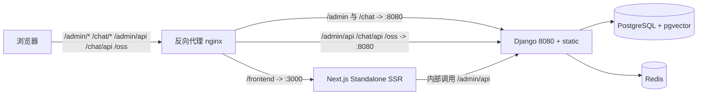

# MaxKB 新增 Next.js + React + Ant Design 前端模块（frontend）架构设计方案

> 版本：v1.0　|　状态：设计方案（仅文档，不改动业务代码）　|　日期：2026-07-08

---

## 0. 文档目的与范围

本文档描述在 **完全不改动现有 `ui/`（Vue admin + Vue chat）、`main.py` 以及 `apps/maxkb` 后端代码** 的前提下，于仓库根目录新增一个独立前端工程 **`frontend/`**，用 **Next.js（App Router）+ React + Ant Design** 实现对标原 `admin` 管理后台的管理控制台。

**不在本文档范围内**：实际编码实现、`ui/` 任何文件的修改、后端 `STATICFILES_DIRS` / `collect_static` / URL 路由的改动。

**目标读者**：前端架构师、全栈工程师、DevOps。

**阅读后期望效果**：读者能理解新模块的目录结构、与现有 Vue 工程的共存部署方式、各 Vue 能力（路由/状态/国际化/组件/请求/工作流）在 React 侧的等价实现，以及可执行的迁移阶段路线图。

---

## 1. 背景与约束

### 1.1 现状

- 仓库前端位于 `ui/`，包含 **两个独立 Vue3 SPA**：
  - `admin`：管理后台，`/admin/`，入口 `ui/admin.html`，env 见 `ui/env/.env`（`VITE_BASE_PATH=/admin`）。
  - `chat`：用户对话端，`/chat/`，入口 `ui/chat.html`，env 见 `ui/env/.env.chat`（`VITE_BASE_PATH=/chat`）。
- 技术栈（`ui/package.json`）：Vue 3.5 + Element Plus 2.13 + Pinia 3 + vue-router 4 + vue-i18n 11 + `@logicflow/core` / `@logicflow/extension`（工作流编辑器）+ echarts / mermaid / marked / md-editor-v3 / vue-codemirror / cropperjs / sortablejs / jsencrypt 等。
- 构建：`ui/vite.config.ts` 双入口、`base: './'`、dev 代理（`/admin/api`、`/chat/api`、`/doc`、`/schema`、`/static`、`/oss` 转发到 `127.0.0.1:8080`），产物输出 `ui/dist<base_path>`，并由 `renameHtmlPlugin` 把入口重命名为 `index.html`。
- 规模：`ui/src` 下约 **505 个 `.vue` 文件、324 个 `.ts`**。关键目录：`api/`(83)、`components/`(164)、`views/`(231)、`workflow/`(168，最复杂)、`layout/`、`stores/`(12)、`router/`(14)、`locales/`(86)、`permission/`(17)、`request/`、`utils/`、`directives/`、`bus/`、`styles/`。

### 1.2 后端集成（本文档不改动，仅说明其约束）

- `apps/maxkb/settings/base/{web,model}.py`：`STATICFILES_DIRS = [ui/dist]`，`STATIC_ROOT = .../static`，`collectstatic` 将 `ui/dist` 收集到 `apps/static/{admin,chat}`。
- `apps/maxkb/urls/web.py`：`pro()` 用 `static.serve` 托管 `apps/static/admin`（`/admin/`）与 `apps/static/chat`（`/chat/`）。`page_not_found` 会读取 `index.html` 并把内联字符串 `prefix: '/admin'`、`chatPrefix: '/chat'` 按 `CONFIG.get_admin_path()` / `get_chat_path()` 做**运行时替换**。
- `main.py`：`collect_static()` 调用 `collectstatic`；`python main.py collect_static` / `start` 等均触发。

### 1.3 硬约束

1. **零侵入**：`ui/`、`main.py`、`apps/maxkb/urls/web.py`、`apps/maxkb/settings/*` 一律不改。
2. **路径隔离**：新模块不得与 `/admin`、`/chat` 冲突，采用 `basePath: '/frontend'`。
3. **复用后端**：新模块复用 Django 现有认证（同域 cookie / token）与 `/admin/api` 接口，不新增后端接口。
4. **chat 端零影响**：原 Vue chat（`/chat`）保持原样由 Django 托管。

---

## 2. 技术栈选型

| 维度 | 现有（Vue） | 新模块（React） | 说明 |
|---|---|---|---|
| 框架 | Vue 3.5 + Vite | **Next.js（App Router）+ React 18 + TS** | `output: 'standalone'`，`basePath: '/frontend'` |
| UI | Element Plus 2.13 | **Ant Design v5** + `@ant-design/nextjs-registry` | 解决 SSR 样式注水 |
| 状态 | Pinia 3 | **Zustand** | 轻量、贴合 hooks；或 Redux Toolkit（可选） |
| 路由 | vue-router 4 | **App Router** | 文件名路由 + `middleware.ts` 鉴权 |
| 国际化 | vue-i18n 11 | **next-intl** | 复用现有 key，不重翻文案 |
| 请求 | axios + fetch + WS | **axios（平移封装）+ fetch + 原生 WS** | 拦截器逻辑平移 |
| 工作流 | `@logicflow/core` + extension | **同库**（框架无关） | React 侧 `useRef`/`useEffect` 封装 |
| 样式 | SCSS + Element 主题 | **Sass Modules + AntD `theme.token`** | 运行期改主题色改为 token 注入 |
| 第三方 | md-editor-v3 / vue-codemirror / sortablejs / echarts / cropperjs / vueuse | `@mdxeditor/react`(或 `md-editor-rt`) / `@uiw/react-codemirror` / `@dnd-kit` / `echarts-for-react` / `react-cropper` / `ahooks` | 详见第 6 章 |

> 选型理由：Ant Design 是 React 生态中与 Element Plus 组件覆盖最接近的后台 UI 库；Zustand 比 Redux 更贴合从 Pinia 迁移的心智；next-intl 与 App Router 集成最顺、且可保留现有 i18n key；LogicFlow 本身与框架无关，可直接在 React 中复用。

---

## 3. 部署拓扑与路径分流（核心）

### 3.1 总体拓扑

反向代理（**nginx 首选，零后端改动**）按路径分流，使 `/admin`、`/chat` 仍由 Django 托管 Vue，新模块 `/frontend` 由独立 Next 进程托管：



### 3.2 路径规划

| 路径 | 托管方 | 说明 |
|---|---|---|
| `/admin` | Django + Vue | 原管理后台，保持不变 |
| `/chat` | Django + Vue | 原对话端，保持不变 |
| `/frontend` | Next.js (`:3000`) | 新 React 管理后台 |
| `/admin/api`、`/chat/api`、`/oss` | Django (`:8080`) | 所有后端 API，统一回源 |

### 3.3 nginx 配置示例（推荐，零后端改动）

```nginx
server {
  listen 80;
  server_name maxkb.example.com;

  # 后端 API：最长前缀优先，确保 /admin/api 不会被 /admin 截断
  location /admin/api/ { proxy_pass http://127.0.0.1:8080; }
  location /chat/api/  { proxy_pass http://127.0.0.1:8080; }
  location /oss/       { proxy_pass http://127.0.0.1:8080; }

  # 原 Vue 静态与管理后台（去掉尾斜杠以同时匹配 /admin 与 /admin/xx）
  location /admin { proxy_pass http://127.0.0.1:8080; }
  location /chat  { proxy_pass http://127.0.0.1:8080; }

  # 新 React 管理后台
  location /frontend {
    proxy_pass http://127.0.0.1:3000;   # Next 已设 basePath:/frontend
    proxy_http_version 1.1;
    proxy_set_header Upgrade $http_upgrade;
    proxy_set_header Connection "upgrade";
    proxy_set_header Host $host;
  }
}
```

### 3.4 关于 `basePath` 的关键说明

- `basePath: '/frontend'` 让 Next **内部路由与静态资源**自动加前缀：`/frontend/login`、`/frontend/_next/...`。
- **业务接口请求不受影响**：前端用 axios 显式请求的 `/admin/api` 是绝对路径，Next 不会为其叠加 `/frontend` 前缀；配合 `next.config` 的 `rewrites` 将其代理到后端 8080（见 3.5）。
- 现有 `prefix` / `chatPrefix` 运行时 HTML 替换逻辑**只作用于 `ui/` 的 Vue `index.html`**，新模块用 Next `basePath` + 构建期注入（`NEXT_PUBLIC_CHAT_PREFIX` 等），二者互不干扰。

### 3.5 `next.config.mjs` 关键契约

```typescript
// frontend/next.config.mjs
/** @type {import('next').NextConfig} */
const nextConfig = {
  basePath: '/frontend',
  output: 'standalone',
  reactStrictMode: true,
  async rewrites() {
    const target = process.env.API_TARGET ?? 'http://127.0.0.1:8080'
    return [
      // basePath: false —— axios 请求的是绝对路径（不含 /frontend 前缀），
      // 禁止 Rewrite 自动叠加 basePath，否则实际匹配会变成 /frontend/admin/api
      { source: '/admin/api/:path*', basePath: false, destination: `${target}/admin/api/:path*` },
      { source: '/chat/api/:path*',  basePath: false, destination: `${target}/chat/api/:path*` },
      { source: '/oss/:path*',       basePath: false, destination: `${target}/oss/:path*` },
      // API 文档与 Django 静态资源（开发期需要，对齐原 vite 代理）
      { source: '/doc/:path*',       basePath: false, destination: `${target}/doc/:path*` },
      { source: '/schema/:path*',    basePath: false, destination: `${target}/schema/:path*` },
      { source: '/static/:path*',    basePath: false, destination: `${target}/static/:path*` },
    ]
  },
}
export default nextConfig
```

### 3.6 Django 反向代理备选（如不愿引入 nginx）

保留现有 Django 静态托管不动，新增一个 Django 视图用 `requests`/`httpx` 将 `/frontend/*` 反向代理到 Next(`:3000`)，并在 `apps/maxkb/urls/web.py` 增加一条 `re_path(r'^{frontend_prefix}[...]', proxy_view)`。**该方案需改后端，优先级低于 nginx，仅在不能引入 nginx 时采用。** 仍**不修改** `prefix`/`chatPrefix` 替换逻辑。

### 3.7 未来可选切换策略（非本次必需）

当 `frontend/` 功能对齐原 admin 后，可将 nginx 中 `/admin` 改为指向 Next，原 Vue admin 下线。此切换**不要求本次改动 `ui/`**，仅变更代理规则，回滚简单。

---

## 4. 工程结构与目录映射

### 4.1 新模块目录（全部为新增，零改动现有文件）

```
frontend/                                 # [NEW] 独立 Next.js 工程（与 ui/、apps/ 并列）
├── app/
│   ├── layout.tsx                        # [NEW] 根布局：AntD Registry + Intl + Zustand Provider
│   ├── (admin)/
│   │   ├── layout.tsx                    # [NEW] 后台框架布局（侧边栏/顶栏，对等 layout/*）
│   │   ├── login/page.tsx                # [NEW] 登录页
│   │   ├── home/page.tsx                 # [NEW] 工作台
│   │   ├── application/...               # [NEW] 应用/工作流入口
│   │   ├── knowledge/...                 # [NEW] 知识库/文档/段落
│   │   ├── model/...                     # [NEW] 模型提供方
│   │   ├── system/...                    # [NEW] 系统设置
│   │   ├── tool/...                      # [NEW] 工具库
│   │   └── trigger/...                   # [NEW] 触发器
├── components/                           # [NEW] 通用组件（Table/Form/Modal/Message 封装，对等 components/*）
│   └── workflow/                         # [NEW] LogicFlow React 封装与节点 renderer
├── lib/
│   ├── request.ts                        # [NEW] axios 实例 + 拦截器（平移 request/index.ts）
│   ├── api/                              # [NEW] 业务接口（平移 api/*，83 文件）
│   ├── permission.ts                     # [NEW] usePermission + hasPermission（平移 permission/utils）
│   └── store/                            # [NEW] Zustand slices（平移 stores/modules/*）
├── messages/                             # [NEW] next-intl 语言包（平移 locales/lang/*）
├── middleware.ts                         # [NEW] 路由鉴权守卫（平移 router.beforeEach）
├── next.config.mjs                       # [NEW] basePath '/frontend' + rewrites 到 Django 8080
├── styles/                               # [NEW] 全局样式 + AntD token（平移 styles/*）
├── package.json                          # [NEW] 独立依赖与脚本（dev/build/start）
├── tsconfig.json                         # [NEW] Next.js TypeScript 配置
└── .env.local                            # [NEW] NEXT_PUBLIC_* 环境变量
```

### 4.2 目录映射表（Vue → React）

| 现有（ui/src） | 新模块（frontend） | 备注 |
|---|---|---|
| `views/*` | `app/(admin)/<module>/page.tsx` | 按 `router/modules` 拆分 |
| `components/*` | `components/*` | AntD 封装后通用组件 |
| `layout/*` | `app/(admin)/layout.tsx` + `components/layout/*` | 侧边栏/顶栏/登录布局 |
| `workflow/*` | `components/workflow/*` | LogicFlow React 封装 + 节点 renderer |
| `stores/modules/*` | `lib/store/*.ts` | Zustand slice |
| `api/*` | `lib/api/*` | axios 实例复用 |
| `request/*` | `lib/request.ts` | 拦截器平移 |
| `locales/lang/*` | `messages/<locale>.ts` | next-intl |
| `permission/*` | `lib/permission.ts` + `middleware.ts` | 双层校验 |
| `utils/*` `directives/*` `bus/*` | `lib/*`、AntD `App` 上下文、`eventemitter` | 指令→组件/hook，事件总线→emitter |
| `styles/*` | `styles/*` | Sass Modules + AntD token |

### 4.3 新模块内部调用链

- **启动链**：`app/layout.tsx`（AntD Registry + `NextIntlClientProvider` + Zustand Provider）→ `app/(admin)/layout.tsx`（侧边栏/顶栏框架）。
- **鉴权链**：`middleware.ts` 读取 cookie token，未登录重定向 `/frontend/login`。
- **接口链**：`lib/request.ts`（经 rewrites 到 Django）。
- **工作流链**：`components/workflow/Editor.tsx`（client-only，动态注册 React 节点）。

---

## 5. 核心能力映射（路由 / 状态 / 请求 / 国际化）

### 5.1 路由：vue-router → App Router

| Vue 概念 | React 等价 |
|---|---|
| `router/index.ts` + `router/modules/*.ts` | `app/(admin)/<module>/page.tsx`（文件名路由） |
| 动态路由 `:id` | `[id]/page.tsx` |
| 嵌套路由 | 嵌套 `layout.tsx` + 子目录 |
| `router.beforeEach` 鉴权/重定向 | `middleware.ts`（边缘运行时读 cookie） |
| `<router-view>` / `<router-link>` | 布局插槽 / `next/link` 或 `useRouter` |
| 菜单权限过滤 | `usePermission()` + 菜单配置 `meta.permission` |

**鉴权 middleware 示例**：

```typescript
// frontend/middleware.ts
import { NextRequest, NextResponse } from 'next/server'

const ADMIN_BASE = '/frontend'
const LOGIN_PATH = '/login'

export function middleware(req: NextRequest) {
  const { pathname } = req.nextUrl
  // pathname 包含 basePath，例如 /frontend/login、/frontend/home
  const token = req.cookies.get('MAXKB-TOKEN')?.value
  const isLogin = pathname === `${ADMIN_BASE}${LOGIN_PATH}`
  if (!token && !isLogin) {
    const url = req.nextUrl.clone()
    url.pathname = `${ADMIN_BASE}${LOGIN_PATH}`
    return NextResponse.redirect(url)
  }
  if (token && isLogin) {
    const url = req.nextUrl.clone()
    url.pathname = `${ADMIN_BASE}/home`
    return NextResponse.redirect(url)
  }
  return NextResponse.next()
}

// matcher 由 Next 在 basePath 剥离后匹配，因此不能含 /frontend 前缀。
// 使用 '/((?!_next|api|static|favicon).*)' 排除静态资源与 API 请求。
export const config = {
  matcher: ['/((?!_next|api|static|favicon).*)'],
}
```

> 注：`ADMIN_BASE = '/frontend'`。`req.nextUrl.pathname` **包含** `basePath`（例如 `/frontend/login`），但 `matcher` 匹配时 Next 会**先剥离 `basePath`**（例如 `/frontend/login` 剥离后为 `/login` 再匹配）。因此 matcher 不能包含 `/frontend` 前缀。

### 5.2 状态：Pinia → Zustand

- 12 个 Pinia store（`stores/modules/*`）映射为 `lib/store/*.ts` 的 Zustand slice。
- 迁移要点：`defineStore({ state, getters, actions })` → `create((set, get) => ({ ... }))`；组件内 `useXxxStore()` 用法保持一致（hooks 调用）。
- 持久化（如主题/语言）：沿用 `zustand/middleware` 的 `persist`，替代原 Pinia + `localStorage` 手写逻辑。

```typescript
// frontend/lib/store/user.ts（示意）
import { create } from 'zustand'
import { persist } from 'zustand/middleware'

export const useUserStore = create(persist((set) => ({
  user: null,
  permissions: [] as string[],
  setUser: (u: any) => set({ user: u, permissions: u?.permissions ?? [] }),
  logout: () => set({ user: null, permissions: [] }),
}), { name: 'maxkb-user' }))
```

### 5.3 请求层：axios 封装平移

- 平移 `request/index.ts` 的拦截器逻辑：注入 `AUTHORIZATION: Bearer <token>`、`Accept-Language`；统一处理 `401→/login`、`403→message.error`、业务错误码、流式（fetch + `ReadableStream`）、`blob` 导出、WebSocket。
- `baseURL` 由 `prefix + '/api'` 改为 `/admin/api`（与 3.5 rewrites 对齐）；`timeout` 保留（约 1800000ms，兼容长任务）。

```typescript
// frontend/lib/request.ts（示意）
import axios from 'axios'
import { message } from 'antd'

const request = axios.create({ baseURL: '/admin/api', timeout: 1800000 })

request.interceptors.request.use((cfg) => {
  const token = document.cookie.match(/MAXKB-TOKEN=([^;]+)/)?.[1]
  if (token) cfg.headers.Authorization = `Bearer ${token}`
  return cfg
})

request.interceptors.response.use(
  (res) => res.data,
  (err) => {
    if (err.response?.status === 401) message.error('登录已失效，请重新登录')
    else message.error(err.response?.data?.message ?? '请求失败')
    return Promise.reject(err)
  },
)

export default request
```

### 5.4 国际化：vue-i18n → next-intl

- 平移 `locales/lang/*`（86 个语言包）到 `messages/<locale>.ts`，**key 严格保持不变**，避免重新翻译。
- 在 `app/layout.tsx` 用 `NextIntlClientProvider` 注入；服务端组件用 `getTranslations`、客户端用 `useTranslations`。
- 外置语言包发现机制（`/chat/locales` 前缀）在 admin 中按同样前缀保留。

```typescript
// frontend/i18n.ts（next-intl 配置示例）
import createMiddleware from 'next-intl/middleware'
export default createMiddleware({
  locales: ['zh-CN', 'en-US'],
  defaultLocale: 'zh-CN',
})
```

---

## 6. UI 组件替换与主题

### 6.1 Element Plus → Ant Design 组件映射表

| Element Plus | Ant Design | 备注 |
|---|---|---|
| `el-table` / `el-table-column` | `Table` / `Table.Column` | 分页、虚拟滚动用 `Table` props |
| `el-form` / `el-form-item` | `Form` / `Form.Item` | 校验规则平移 |
| `el-dialog` | `Modal` | `visible`→`open` |
| `el-drawer` | `Drawer` | |
| `el-message` / `el-notification` | `message` / `notification` | `App` 上下文注入 |
| `el-tabs` / `el-tab-pane` | `Tabs` / `Tabs.Item` | |
| `el-menu` / `el-sub-menu` | `Menu` | 侧边栏 |
| `el-input` / `el-input-number` | `Input` / `InputNumber` | |
| `el-select` / `el-option` | `Select` / `Select.Option` | |
| `el-button` | `Button` | |
| `el-upload` | `Upload` | |
| `el-tooltip` / `el-popconfirm` | `Tooltip` / `Popconfirm` | |
| `el-switch` / `el-radio` | `Switch` / `Radio` | |
| `el-card` / `el-descriptions` | `Card` / `Descriptions` | |
| `el-tree` / `el-transfer` | `Tree` / `Transfer` | |
| `el-steps` / `el-progress` | `Steps` / `Progress` | |

### 6.2 主题与样式迁移

- 原 `use-element-plus-theme` 的**运行期改主题色**改为 AntD `ConfigProvider` 的 `theme.token.colorPrimary` 动态注入（读 Zustand 主题 slice）。
- 原 `styles/*.scss`、暗色主题：保留为 Sass Modules，全局 token 通过 `ConfigProvider` 注入；暗色用 `theme.algorithm = theme.darkAlgorithm`。
- 避免引入任何 Vue 专属依赖（如 `use-element-plus-theme`）。

```tsx
// frontend/app/layout.tsx（主题注入示意）
'use client'
import { AntdRegistry } from '@ant-design/nextjs-registry'
import { ConfigProvider, App as AntdApp } from 'antd'
import { useUserStore } from '@/lib/store/user'
import zhCN from 'antd/locale/zh_CN'

export default function RootLayout({ children }: { children: React.ReactNode }) {
  const primary = useUserStore((s) => s.themePrimary) ?? '#1677FF'
  return (
    <html lang="zh-CN">
      <body>
        <AntdRegistry>
          <ConfigProvider locale={zhCN} theme={{ token: { colorPrimary: primary } }}>
            <AntdApp>{children}</AntdApp>
          </ConfigProvider>
        </AntdRegistry>
      </body>
    </html>
  )
}
```

---

## 7. 工作流编辑器与第三方库替代

### 7.1 LogicFlow 工作流（重点，168 文件）

- `@logicflow/core` / `@logicflow/extension` **与框架无关**，可直接复用；在 React 中以 `useRef` + `useEffect` 初始化画布。
- 编辑器依赖 DOM/画布，**必须用 `dynamic(() => import('./Editor'), { ssr: false })` 客户端加载**，避免 SSR 报错；仅在工作流页按需懒加载，控制包体与内存。
- `ui/src/workflow/*` 中 118 个 `.vue` 节点 renderer 需改写为 React 组件（`components/workflow/nodes/*`），节点注册方式由 `lf.register()` 保持一致。

```tsx
// frontend/components/workflow/Editor.tsx（示意，ssr:false 动态加载）
'use client'
import { useEffect, useRef } from 'react'
import LogicFlow from '@logicflow/core'
import '@logicflow/core/dist/index.css'

export default function Editor({ data }: { data: any }) {
  const ref = useRef<HTMLDivElement>(null)
  useEffect(() => {
    if (!ref.current) return
    const lf = new LogicFlow({ container: ref.current, grid: true })
    lf.render(data)
    ;(window as any).__lf = lf
    return () => lf.destroy()
  }, [data])
  return <div ref={ref} style={{ width: '100%', height: '100%' }} />
}
```

### 7.2 第三方库 React 替代清单

| 现有（Vue） | React 替代 | 说明 |
|---|---|---|
| `md-editor-v3` | `@mdxeditor/react`（或 `md-editor-rt`） | Markdown 编辑/预览 |
| `vue-codemirror` | `@uiw/react-codemirror` | 代码编辑器 |
| `sortablejs` / `vue-draggable-plus` | `@dnd-kit/core` + `@dnd-kit/sortable` | 拖拽排序 |
| `echarts` | `echarts-for-react` | 图表 |
| `cropperjs` | `react-cropper` | 图片裁剪 |
| `jsencrypt` | `jsencrypt`（通用） | 加密，可直接用 |
| `mermaid` | `mermaid`（通用） | 流程图，直接用 |
| `highlight.js` / `katex` | 同库（通用） | 代码高亮/公式 |
| `vueuse/core` | `ahooks` | 组合式工具 |
| `nprogress` | `nprogress`（通用）或 AntD `Spin` | 路由 loading |

---

## 8. 构建、脚本与环境变量

### 8.1 新模块独立脚本（`frontend/package.json`）

```jsonc
{
  "scripts": {
    "dev": "next dev -p 3000",
    "build": "next build",
    "start": "next start -p 3000",
    "lint": "next lint",
    "type-check": "tsc --noEmit"
  }
}
```

- **不涉及** `ui/` 的 `vite.config.ts`，也**不涉及** `main.py` 的 `collect_static`（其只收集 `ui/dist`，新模块独立部署）。
- 新模块用 `next build` 产出 `.next`，`output: 'standalone'` 时额外生成 `standalone` 自包含运行包。

### 8.2 环境变量（`frontend/.env.local`）

| 变量 | 含义 | 示例 |
|---|---|---|
| `NEXT_PUBLIC_BASE_PATH` | 与 `basePath` 对齐 | `/frontend` |
| `NEXT_PUBLIC_CHAT_PREFIX` | chat 端路径（用于站内跳转/埋点） | `/chat` |
| `API_TARGET` | 后端地址（rewrites 用） | `http://127.0.0.1:8080` |

> 原 `ui/env/.env` 的 `VITE_*` 不沿用；新模块用 `NEXT_PUBLIC_*`，构建期内联。

### 8.3 TypeScript 配置

- `frontend/tsconfig.json` 基于 `next` 推荐配置；`@/*` 指向工程根（`compilerOptions.paths`）。
- 保留 `verbatimModuleSyntax: false`、`noUnusedLocals: false` 以平滑迁移。

---

## 9. 迁移阶段路线图

采用**"新建式"移植**：原 `ui/` 全程不动，新模块按以下阶段逐步建设。

- **阶段 0 — 脚手架**：`frontend/` 工程、`basePath`/`rewrites`、根 `layout.tsx`（AntD Registry + Intl + Zustand Provider）、`next.config.mjs`、env、tsconfig。
- **阶段 1 — 核心设施**：请求层 `lib/request.ts`、store 映射、i18n、permission hook、`(admin)/layout.tsx` 框架、路由壳 + 鉴权 `middleware.ts`、登录页。
- **阶段 2 — 共享组件与主题**：Table/Form/Modal/Message 封装、AntD 主题 token、样式迁移、暗色主题。
- **阶段 3 — 业务模块**：`home`（工作台）、`system`、`model`（模型提供方）、`knowledge/document/paragraph`、`application`、`tool`、`trigger`。
- **阶段 4 — 工作流编辑器**：LogicFlow React 封装 + 节点 renderer，按需懒加载 `ssr:false`。
- **阶段 5 — 联调与验证**：nginx 分流、SSR 数据、权限、i18n、e2e；**确保原 `/admin`、`/chat` 不受影响**。

### 9.1 防回归清单

- 零改动 `ui/`、`main.py`、`apps/maxkb/urls/web.py`、`apps/maxkb/settings/*`。
- 新模块独立 `build`/`start`，**不进入** `collect_static` 流程。
- 语言包 key 严格不变；`hasPermission`（OR/AND 语义）平移为 `usePermission` hook + `middleware` 双层校验。
- 主题色改为 AntD token 注入，移除 Vue 专属主题依赖。
- 日志仅保留必要接口错误提示，避免敏感信息外泄。

---

## 10. 验证方式

- **本地联调**：`cd frontend && npm i && npm run dev`（`:3000`），经 `rewrites` 访问 `127.0.0.1:8080` 的 `/admin/api`；`npm run build && npm run start` 验证 standalone SSR。
- **回归校验**（原工程零影响）：
  - 原 `/admin`（Vue）独立可用；
  - 原 `/chat`（Vue）独立可用；
  - 新 `/frontend` 登录态、菜单权限、语言切换、主题色、工作流增删节点与连线、导出/流式接口正常。
- **构建不改动后端**：`main.py collect_static` 仍只收集 `ui/dist`，新模块产物独立托管。

---

## 11. 风险与缓解

| 风险 | 缓解 |
|---|---|
| SSR 下 LogicFlow / 富交互组件报错 | `dynamic(import, { ssr: false })` 客户端加载 |
| AntD 样式闪烁（SSR） | `@ant-design/nextjs-registry` 样式注水 |
| 语言包 key 不一致导致缺文案 | 平移时 key 严格不变，自动化 diff 校验 |
| 权限语义偏差（OR/AND） | `usePermission` + `middleware` 双层，单测覆盖 |
| 路径冲突（/admin、/chat） | `basePath: '/frontend'` 隔离 + nginx 分流 |
| 迁移周期过长 | 按业务域分阶段，每阶段可独立验证，chat 零风险 |

---

## 附录 A：关键契约速查

- `basePath: '/frontend'`（Next 内部路由/资源前缀）
- API：`/admin/api`（复用 Django 现有接口，rewrites 到 8080）
- 鉴权：同域 cookie `MAXKB-TOKEN`
- 状态：Zustand；国际化：next-intl；UI：Ant Design v5
- 部署：nginx 分流，`/frontend` → Next(`:3000`)，其余 → Django(`:8080`)

## 附录 B：与现有工程的边界

| 项目 | 是否改动 | 说明 |
|---|---|---|
| `ui/`（含 admin、chat） | 否 | 全部保留，继续由 Django 托管 |
| `main.py` | 否 | `collect_static` 仅收集 `ui/dist` |
| `apps/maxkb/urls/web.py` | 否 | `prefix`/`chatPrefix` 替换逻辑仅作用于 Vue index.html |
| `apps/maxkb/settings/*` | 否 | `STATICFILES_DIRS` 不变 |
| `frontend/`（新增） | 是 | 本文档描述的新模块 |
